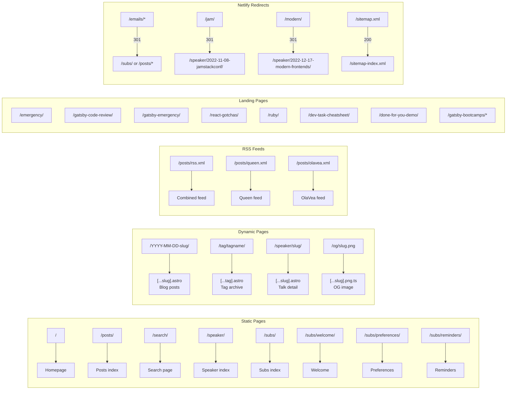

# Technical Review Findings — queen.raae.codes

**Date:** 2026-02-03
**Scope:** Full codebase review of the Astro 5 site

---

## Site Architecture Diagram

```mermaid
graph TD
    subgraph Deployment
        Netlify["Netlify<br/>(netlify.toml)"]
    end

    subgraph Build
        Astro["Astro 5<br/>(astro.config.mjs)"]
        MDX["@astrojs/mdx"]
        TW["@astrojs/tailwind"]
        SM["@astrojs/sitemap"]
        Sharp["Sharp<br/>(image processing)"]
        Satori["Satori<br/>(OG images)"]
    end

    subgraph Pages["src/pages/"]
        Index["index.astro<br/>(Homepage)"]
        CatchAll["[...slug].astro<br/>(Blog posts)"]
        PostsIndex["posts/index.astro"]
        RSS_All["posts/rss.xml.ts"]
        RSS_Queen["posts/queen.xml.ts"]
        RSS_Ola["posts/olavea.xml.ts"]
        OG["og/[...slug].png.ts"]
        TagPage["tag/[...tag].astro"]
        Search["search/index.astro"]
        Speaker["speaker/index.astro"]
        SpeakerSlug["speaker/[...slug].astro"]
        Subs["subs/ (3 pages)"]
        LandingPages["Landing pages<br/>(8 pages)"]
    end

    subgraph Components["src/components/"]
        BaseLayout["BaseLayout.astro"]
        SiteHeader["SiteHeader.astro"]
        Newsletter["Newsletter.astro"]
        PageSection["PageSection.astro"]
        PSHeader["PageSectionHeader.astro"]
        PSBreadcrumbs["PageSectionBreadcrumbs.astro"]
        Posts["Posts.astro"]
        ContentList["ContentList.astro"]
        Prose["Prose.astro"]
        Badge["Badge.astro"]
        Noteworthy["Noteworthy.astro"]
        CtaButton["CtaButton.astro"]
        CtaSection["CtaSection.astro"]
    end

    subgraph Lib["src/lib/"]
        PostsLib["posts.ts"]
        OGLib["og-image.ts"]
        FeedLib["feed.ts"]
        DisclaimersLib["disclaimers.ts"]
    end

    subgraph Content["src/content/"]
        PostsQueen["posts-queen/<br/>~250 posts"]
        PostsOlavea["posts-olavea/<br/>~200 posts"]
        Landing["landing/<br/>8 entries"]
        Talks["talks/<br/>5 entries"]
        Tags["tags/<br/>(YAML)"]
        Testimonials["testimonials/<br/>(YAML)"]
        Config["config.ts<br/>(Zod schemas)"]
    end

    subgraph Legacy["Legacy / Dead Code"]
        Services["src/services/<br/>(github.js, stripe.js,<br/>discounts.json)"]
        Template["src/templates/<br/>posts-tag-archive.js"]
        RootContent["content/<br/>(duplicate mirror)"]
    end

    subgraph External["External Services"]
        ConvertKit["ConvertKit API"]
        Fathom["Fathom Analytics"]
        FuseJS["Fuse.js CDN"]
        Twemoji["Twemoji CDN"]
    end

    Netlify --> Astro
    Astro --> MDX
    Astro --> TW
    Astro --> SM
    Astro --> Sharp

    Index --> BaseLayout
    Index --> PostsLib
    CatchAll --> PostsLib
    CatchAll --> DisclaimersLib
    CatchAll --> OGLib
    PostsIndex --> PostsLib
    RSS_All --> PostsLib
    RSS_All --> FeedLib
    RSS_Queen --> PostsLib
    RSS_Queen --> FeedLib
    RSS_Ola --> PostsLib
    RSS_Ola --> FeedLib
    OG --> PostsLib
    OG --> OGLib
    TagPage --> PostsLib
    Search --> PostsLib

    OGLib --> Satori
    OGLib --> Sharp
    OGLib --> Twemoji

    Newsletter --> ConvertKit
    BaseLayout --> Fathom
    Search --> FuseJS

    PostsLib --> PostsQueen
    PostsLib --> PostsOlavea
    FeedLib --> DisclaimersLib
    DisclaimersLib --> Tags

    Config --> PostsQueen
    Config --> PostsOlavea
    Config --> Landing
    Config --> Talks
    Config --> Tags
    Config --> Testimonials
```



## Page Routing Diagram



---

## Summary

The site is well-structured for an Astro 5 static site with content collections. The migration from Gatsby is functionally complete, but several artifacts from the Gatsby era remain. The findings below are organized by severity.

---

## Critical Issues

### 1. XSS Vulnerability in Search Page
**File:** `src/pages/search/index.astro:128-161`

The search results are rendered using `innerHTML` with data that includes user-searchable content (post titles, descriptions). The `highlightMatches` function wraps matched text in `<mark>` tags, but the surrounding text is inserted raw into the DOM via `innerHTML`. If any post title or description contains HTML characters, they will be rendered as HTML.

While the data source is author-controlled markdown (low risk in practice), this is a pattern violation. Using `textContent` for non-highlighted portions or escaping HTML entities before insertion would be the proper fix.

### 2. XSS Risk in Posts Component
**File:** `src/components/Posts.astro:22-29`

Tag labels are interpolated directly into HTML strings without escaping:
```js
const tagBadges = tags.map(({ label }) =>
  `<span class="...">${label}</span>`
).join(' ');
```
These strings are then rendered via `set:html` in `ContentList.astro:55`. If a tag label contained HTML, it would be rendered. The risk is low since tags come from frontmatter, but this pattern should be avoided.

---

## High Priority — Dead Code and Gatsby Leftovers

### 3. Legacy Gatsby Template Still Present
**File:** `src/templates/posts-tag-archive.js`

This is a complete React/Gatsby page template with `graphql` imports, `PageHead`, `gatsby` components. It serves no purpose in the Astro build and should be deleted.

### 4. Unused Service Modules
**Files:**
- `src/services/github.js` — GitHub API client using `axios` (not in dependencies)
- `src/services/stripe.js` — Stripe checkout session helper using `stripe` (not in dependencies)
- `src/services/discounts.json` — Spotify pricing data (640 lines, unrelated to site)

None of these are imported anywhere in the Astro codebase. They appear to be leftover from the Gatsby-era serverless functions. They import packages (`axios`, `stripe`) that are not in `package.json`. They should all be deleted.

### 5. Duplicate Root `content/` Directory
**Path:** `/content/` (root level)

The root `content/` directory mirrors `src/content/`. The CLAUDE.md even notes that "the canonical source is `src/content/`." This duplicate is confusing and should be removed or symlinked to avoid content drift.

---

## Medium Priority — Configuration Issues

### 6. Prettier Config Path Mismatch
**File:** `package.json:12`

The prettier script references `--config ./.prettierrc.js` but the actual config file is `.prettierrc` (JSON format, no `.js` extension). This means prettier may not pick up the configured `printWidth: 120` and would fall back to defaults.

### 7. Outdated Tailwind CSS Version
**File:** `package.json:30`

Tailwind CSS is pinned to `3.1.8` (July 2022). The latest Tailwind 3.x is 3.4.x with significant improvements (dynamic viewport units, `has()` variants, `size-*` utilities, etc.). This is a safe upgrade within the 3.x line.

### 8. Several Pinned Dependencies Are Very Old
**File:** `package.json`

| Package | Current | Latest
| --- | --- | --- |
| `tailwindcss` | 3.1.8 | 3.4.x |
| `@tailwindcss/forms` | 0.5.3 | 0.5.9+ |
| `@tailwindcss/typography` | 0.5.8 | 0.5.15+ |
| `autoprefixer` | 10.4.12 | 10.4.20+ |
| `postcss` | 8.4.18 | 8.4.47+ |
| `date-fns` | 2.29.3 | 3.x or 4.x |
| `clsx` | 1.2.1 | 2.x |
| `prettier` | ^2.7.1 | 3.x |
| `@commitlint/cli` | ^17.1.2 | 19.x |
| `husky` | ^8.0.1 | 9.x |

These are exact-pinned (no `^`), so they won't update even with `npm update`. Consider updating to latest patch/minor versions and using `^` for safer auto-updates.

### 9. No ESLint Configuration
There is no `.eslintrc` or equivalent. While Prettier handles formatting, ESLint catches logical errors, unused variables, and accessibility issues. Consider adding `eslint` with `eslint-plugin-astro` for Astro-specific linting.

---

## Low Priority — Code Quality

### 10. `getAllPosts()` Called Multiple Times Per Build
**Files:** Multiple pages call `getAllPosts()` independently:
- `src/pages/index.astro`
- `src/pages/[...slug].astro` (via `getStaticPaths`)
- `src/pages/posts/index.astro`
- `src/pages/search/index.astro`
- `src/pages/tag/[...tag].astro` (via `getAllTags()`)
- `src/pages/og/[...slug].png.ts`
- RSS feed files (3x)

Each call re-fetches and re-processes all posts from both collections. For ~450 posts, this means parsing markdown excerpts, date formatting, and tag parsing is done 9+ times during a build. Consider caching with a module-level variable or Astro's built-in content layer caching.

### 11. `getPostBySlug` Is Inefficient
**File:** `src/lib/posts.ts:143-146`

`getPostBySlug` calls `getAllPosts()` (processing all ~450 posts) just to find one. This function isn't currently called in production code, but if used, it would be very wasteful.

### 12. Typo in PageSectionBreadcrumbs
**File:** `src/components/PageSectionBreadcrumbs.astro:45`

The `<time>` element uses `timedate` instead of the correct HTML attribute `datetime`:
```html
<time timedate={datetime}>{label}</time>
```
This means the machine-readable datetime is not actually being set on the element.

### 13. Hardcoded Background Color Mismatch
**File:** `src/layouts/BaseLayout.astro:92-93`

The body has `class="bg-orange-300"` but the inner div uses `bg-[#fcedd8]`, and `PageSection.astro` alternates between `bg-[#fffaf0]` and `bg-[#fcedd8]`. These hardcoded hex values bypass the Tailwind color system. Consider defining them as custom colors in `tailwind.config.js` for consistency.

### 14. Hardcoded Noteworthy Data
**File:** `src/components/Noteworthy.astro:11-37`

Talk/webinar listings are hardcoded in the component rather than sourced from the `talks` content collection. This creates a maintenance burden and risks data divergence — the talks collection exists but isn't used here.

### 15. `siteMetadata.js` Uses CommonJS-style Default Export
**File:** `src/data/siteMetadata.js`

This file uses `export default { ... }` (fine in ESM) but is a `.js` file rather than `.ts`. It lacks type definitions, making it harder to catch errors when properties are added or renamed.

### 16. Twitter Branding Is Outdated
**File:** `src/data/siteMetadata.js:12`

Social links reference `twitter.com` and use Twitter branding in the header SVG icons. The platform rebranded to X in 2023. The `SiteHeader.astro` also labels the link as "twitter" in the sr-only text.

### 17. Schema.org Image URL May Include Cache-Bust Query
**File:** `src/pages/[...slug].astro:50`

The structured data image URL is generated via `getOgImageUrl()` which appends `?v=hash`. Schema.org validators may flag this. Consider using `getOgImagePath()` (without hash) for structured data.

### 18. `Prose` Component Has Unused `html` Prop
**File:** `src/components/Prose.astro:7`

The `html` prop with `set:html` is defined but never actually used by any caller — all callers use the `<slot />` pattern instead. Dead prop.

---

## Accessibility

### 19. External Link Icons Lack Consistent `aria-hidden`
**Files:** `ContentList.astro`, `CtaButton.astro`, `SiteHeader.astro`, `speaker/index.astro`

The external link SVG icons (the arrow-out-of-box icon) are decorative but are not consistently marked with `aria-hidden="true"`. Some instances have it, others don't.

### 20. Search Input Missing `aria-describedby` for Results
**File:** `src/pages/search/index.astro:29`

The search input could benefit from `aria-live="polite"` on the results container so screen readers announce when results change.

---

## Performance

### 21. Fuse.js Loaded from CDN at Runtime
**File:** `src/pages/search/index.astro:73`

Fuse.js is loaded dynamically by creating a `<script>` element pointing to a CDN. This bypasses Astro's bundling and has no integrity hash (SRI). Consider either:
- Installing `fuse.js` as a dependency and importing it in a client-side `<script>` with Astro's bundler
- Adding an SRI hash to the script tag for security

### 22. All Search Data Inlined in HTML
**File:** `src/pages/search/index.astro:70`

`define:vars={{ searchData }}` inlines the entire search index (titles, descriptions, tags for ~450 posts) into the page HTML. For large sites, this significantly increases page weight. Consider loading this data as a separate JSON file.

### 23. OG Images Fetches Emoji SVGs from CDN During Build
**File:** `src/lib/og-image.ts:80`

Each unique emoji in post content triggers an HTTP fetch to `cdnjs.cloudflare.com` during build. If the CDN is slow or down, the build will fail or hang. Consider vendoring the needed emoji SVGs locally.

---

## Security

### 24. ConvertKit API Key Exposed in Client Bundle
**File:** `src/components/Newsletter.astro:176`

`import.meta.env.PUBLIC_CK_API_KEY` is used in client-side JavaScript. The `PUBLIC_` prefix makes this intentional (it's a public API key), but be aware this key is visible to anyone viewing the page source. This is acceptable for ConvertKit's subscribe API which is designed for client-side use, but worth noting.

---

## Recommendations Summary

| Priority | Action | Files |
| --- | --- | --- |
| Critical | Fix innerHTML XSS pattern in search | `search/index.astro` |
| High | Delete Gatsby template | `src/templates/posts-tag-archive.js` |
| High | Delete unused services | `src/services/` |
| High | Remove duplicate `content/` dir | `/content/` |
| Medium | Fix prettier config path | `package.json` |
| Medium | Update pinned dependencies | `package.json` |
| Medium | Add ESLint with astro plugin | New config file |
| Medium | Fix `timedate` typo | `PageSectionBreadcrumbs.astro` |
| Low | Cache `getAllPosts()` result | `src/lib/posts.ts` |
| Low | Extract hardcoded colors to config | `tailwind.config.js`, layouts |
| Low | Source Noteworthy from talks collection | `Noteworthy.astro` |
| Low | Bundle Fuse.js properly or add SRI | `search/index.astro` |
| Low | Convert siteMetadata to TypeScript | `siteMetadata.js` → `.ts` |
| Low | Fix `datetime` attribute typo | `PageSectionBreadcrumbs.astro` |
| Low | Remove unused `html` prop from Prose | `Prose.astro` |

---

## What's Done Well

- **Clean component architecture** — Good separation of concerns with reusable components (`PageSection`, `ContentList`, `Badge`, etc.)
- **Type safety** — TypeScript interfaces on component props, Zod schemas on content collections
- **SEO** — Proper canonical URLs, Open Graph tags, Twitter cards, Schema.org structured data on blog posts, sitemap with appropriate exclusions
- **Accessibility basics** — `sr-only` labels on icon links, semantic HTML elements, breadcrumb navigation with `aria-label`
- **Content model** — Well-organized content collections with date-based folder structure
- **OG image generation** — Sophisticated per-author OG images with Satori + Sharp, cache-busting URLs
- **RSS feeds** — Three separate feeds (combined, per-author) with full content including disclaimers
- **Git workflow** — Conventional commits enforced via commitlint + husky, prettier on pre-commit
- **Progressive enhancement** — Newsletter form works with JavaScript for ConvertKit integration, search degrades to showing latest posts
- **Redirect handling** — Comprehensive Netlify redirects preserve all legacy URLs from the Gatsby era
