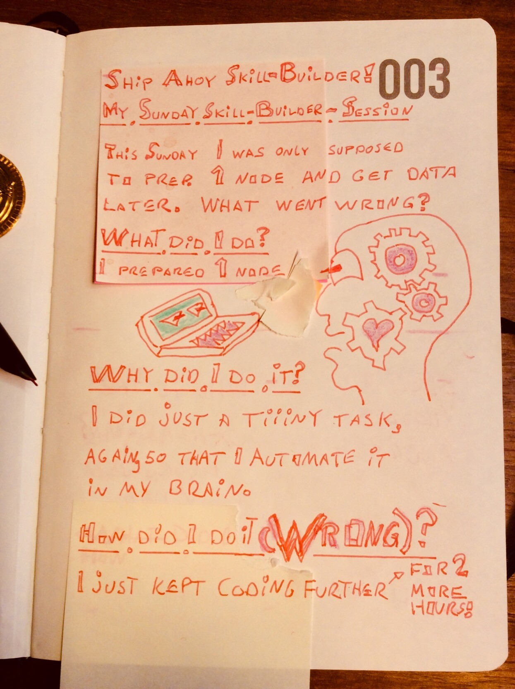

## My Sunday Skill Builder Session:

This Sunday, I was only supposed to prepare 1 node and get data later. What went wrong?

## What did I do?

I prepared 1 node.

## Why did I do it?

I did just a tiiiny task again. So that I automate it in my brain. (That rhymes, when I say it at least... 💪😺)

## How did I do it (WRONG)?

I kept on coding further. For 2 more hours! Live on youtube. What was I thinking?

💪😺👍

Keep your skill-builder-ship afloat this week!

🔧⛵🏴‍☠️

Ola Vea  
Cap'n of his own skill-builder-ship
