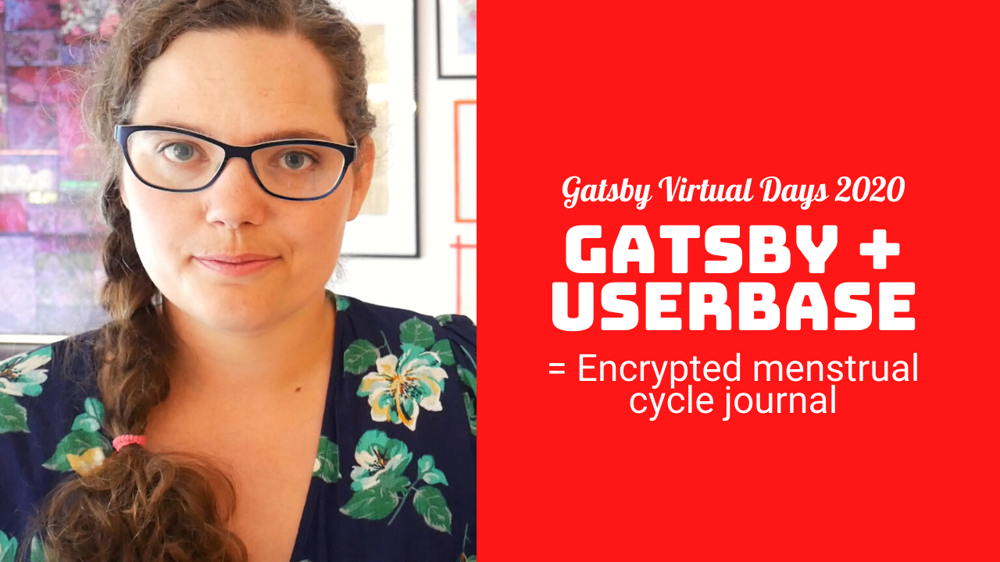

The Gatsby Conf announcement reminded me of how this whole YouTube thing started. In April of 2020, I got asked if I wanted to submit a talk for Gatsby Virtual Days. I did, and Gatsby sent over a microphone, and a ring light... and the rest, as they say, is history 🤪

[The talk](https://youtu.be/kKp7Syxyxnw) walks you through how to create client-side only routes for authenticated users in Gatsby, following [the approach found in the Gatsby Docs](https://www.gatsbyjs.com/docs/how-to/routing/client-only-routes-and-user-authentication/#handling-client-only-routes-with-gatsby).

These days I like to generate a skeleton version of even these pages statically, then sprinkle in the user-specific data when it's loaded and ready. However, the above is still valid and is an excellent approach when converting an existing React app to Gatsby!

&nbsp;  
Have you used Gatsby in a more app-like project?  
Let me know!

&nbsp;  
All the best,  
Queen Raae

&nbsp;  
**PS:** Tonight we are helping Mirjam with the [Conference Buddy v2 authentication flow](https://youtu.be/WzrjHVy134M), not tags as previously announced in Monday's email.
