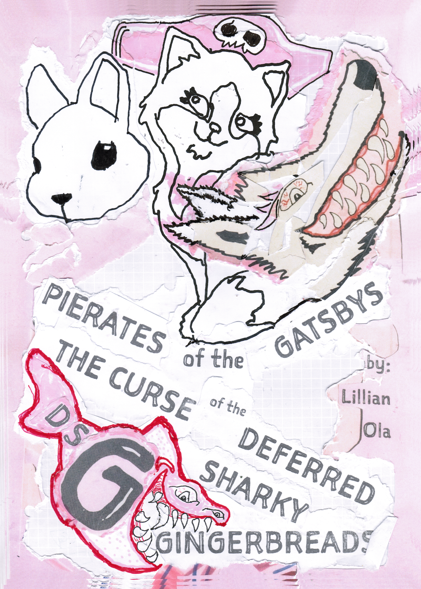

## Not sure how to try DSG? Or why?
DSG, SSG, what's with these acronyms away?

## The Darker DSG-truth
Well, what if the DSG-truth was darker than your darkest dreams? What if you could tell the DSG-story in a way a 6-year-old would remember? Every night, before going to sleep? 🦈 🏴‍☠️ Just kidding. There are ryhmes in there, ryhmes with bunny and kitten. And in the end nobody gets bitten. Maybe. There will be coloring pages and a gingerbread recipe that tastes like.... ginger. A ginger taste as sharp as sharks teeth.

# PIERATES of the GATSBYS
## The Curse of the Deferred Sharky Gingerbread
This winter, coming to you from the duo that made «Ruby's TimeShip, 4 piraty Gatsby functions to jailbreak a sister» and «Gruesome Geir Badger kidnaps the baby bunny». Lillian (6 🏴‍☠️👸) and Ola Vea will bake DSG into a piraty story about the legendary life-&-death-feud between two rival captains. Pirate Captain Winter «Whitey» Fox and Pirate Princess Lilly «Red» Owl and their crazy crews. A baker-bunny and a baker-kitten is caught in the cannon crossfire. And there is A Curse. The DSG Curse. The Curse of the Deferred Sharky Gingerbread. Will our heros find a way to lift the curse?

## Sign up for updates
A behind the scenes look at Lillian (6 🏴‍☠️👸) and Ola Vea's piraty Gatsby skill building with modern tools like: paper, pen, scissors and a Brother DCP-7030 printer-scanner. Sign up for email updates on Lillian (6 🏴‍☠️👸) and Ola Vea's progress and set backs. And get the finished PDF coloring-page-print-out-booklet for free when it is finally finished. If you don't sign up you'll have to pay dearly for it later.

