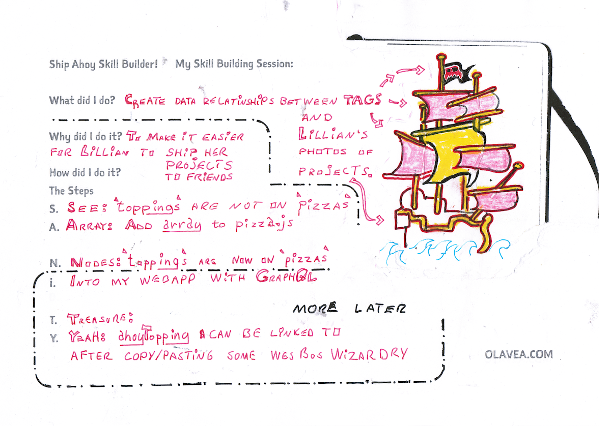

## My Skill Building Session:



## What did I do?

Create data relationship between TAGS and Lillian's photos of projects.

## Why did I do it?

To make it easier for Lillian to ship her projects to friends.

## How did I do it?

**The Plan**

S - See: `toppings` are not on `pizzas` in GraphQL  
A - Array: Add `array` to pizza.js in Sanity

N - Nodes: `toppings` are now on `pizzas` in GraphQL

Look at these steps later:

I - Into my webapp with GraphQL

T - Treasure: TBD  
Y - Yeah: Toppings can be linked in my web app after copy-pasting some Wes Bos wizardry.

## The Steps

### S - See: `toppings` are not on `pizzas` in GraphQL or in GraphiQL

```js
// ToppingsFilter.js
// How do I get a list of all the pizzas with their toppings?
const { pizzas } = useStaticQuery(graphql`
  query {
    pizzas: allSanityPizza {
      nodes {
        // 👁️ Look no "toppings" here 👀
        id
      }
      slug {
        current
      }
    }
  }
}`);
```

### A - Array: Add `array` to pizza.js in Sanity

I added this code to my pizza.js. in Sanity

```js
// schemas/pizza.js
  {
    name: 'toppings',
    title: 'Toppings and Tools and Tags of Pirate Princess Lillian (6 🏴‍☠️👸)',
    type: 'array',
    of: [{ type: 'reference', to: [{ type: 'topping' }] }],
  }
```

### N - Nodes: `toppings` are now on `pizzas` in GraphQL

I looked in my GraphiQL and copy-pasted the new query into ToppingsFilter.js

```js
// Rubys-TimeShip/src/components/ToppingsFilter.js
// This is how do I get a list of all the Pizzas with their toppings!
const { pizzas } = useStaticQuery(graphql`
  query {
    pizzas: allSanityPizza {
      nodes {
        toppings {
          name
          id
        }
        slug {
          current
        }
        id
      }
    }
  }
`);
```

And that's enough steps for this week!

Pirate Princess Lillian joined me at the beginning of Sunday's [skill building session on youtube](https://youtu.be/ix_0vrwQnWk).

If you would like to see how the web app will look in the end [jump to the 20 minute mark](https://youtu.be/ix_0vrwQnWk?t=1200).

💪😺👍  
Keep your skill-building-submarine afloat this week!  
⛵🔧🏴‍☠️

&nbsp;  
Cap'n Ola Vea

&nbsp;  
**PS:** If you feel like doing me a favour give me a smiley emoji comment to feed my youtube algo some vitamins.

- [The web app I am working on](https://timeship1.gatsbyjs.io/pizzas/)
- [Direct link to the 20 minute mark in Sunday's OlaCast on YouTube](https://youtu.be/ix_0vrwQnWk?t=1200)
