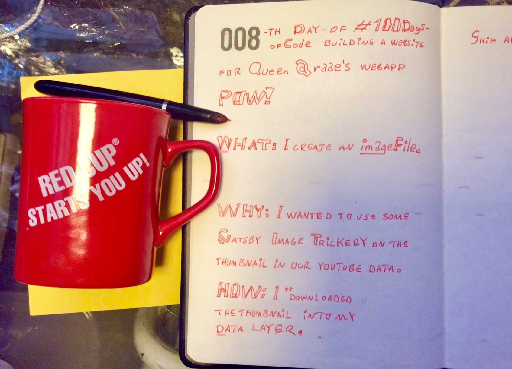

## My Sunday Skill Builder Session:

This Sunday, I created an image file with createRemoteFileNode

## What did I do?

I created an image file to use inside my node

## Why did I do it?

I wanted to use some Gatsby Image trickery on the thumbnail in our youtube data 💪😺. Therefore I downloaded the thumbnail into my data layer. At least, that is how I see it.

## How did I do it?

The short version:

```js
// POW!-website plugins / local - source - youtube / gatsby - node.js;
const { createRemoteFileNode } = require("gatsby-source-filesystem");

const youTubeNodeId = createNodeId(`you-tube-${id}`);

const imageFile = await createRemoteFileNode({
  url: embedData.thumbnail_url,
  parentNodeId: youTubeNodeId,
  getCache,
  createNode,
  createNodeId,
});
```

And then, I use my image file inside my node like this.

```js
createNode({
  thumnail___NODE: imageFile.id,
});
```

For the longer version, watch [Sunday's OlaCast on YouTube](https://youtu.be/LQ2DRJbG8FY)

&nbsp;  
💪😺👍  
Keep your skill-building-ship afloat this week!  
⛵🔧🏴‍☠️

&nbsp;  
Ola Vea  
Cap'n of his own skill-builder-ship
