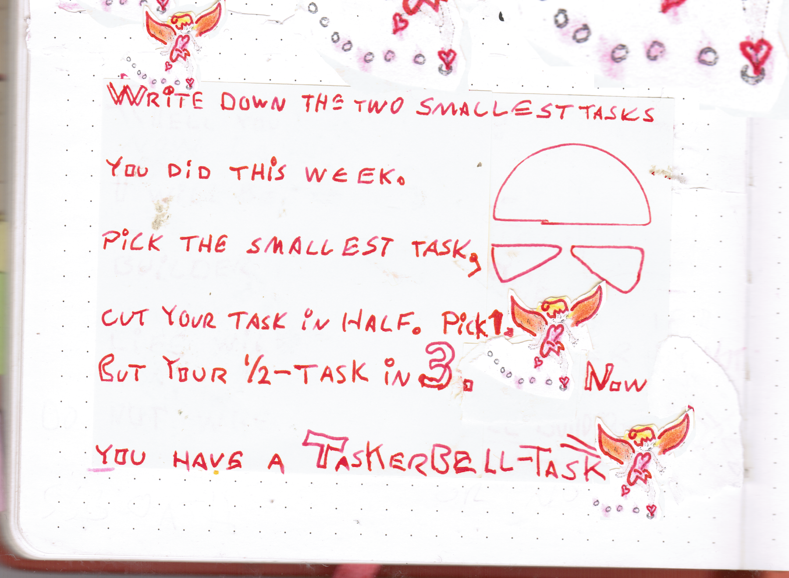

## My Sunday Skill Builder Session:

I made a minimal-doable-task 🧚‍♀️

## What did I do?

I deconstructed a task into a minimal-doable-task

## Why did I do it?

I wanted my task to be tiny, so that I could automate it in my skull, by doing it again and again. Automating it in my skull is skill building.

## How did I do it?

I wrote down the two smallest tasks i did this week. I picked the smallest task, cut it in half. I picked one half. I cut my half-task in 3. Now I have a Taskerbell-Task.

&nbsp;  
💪😺👍  
Keep your skill-building-submarine afloat this week!  
⛵🔧🏴‍☠️

&nbsp;  
Cap'n Ola Vea

&nbsp;  
**PS:** Sunday's #OlaCast is rescheduled for 11:30 CET where you get to see my [minimal-doable-task in action](https://youtu.be/4fQj3YNKYoQ).
