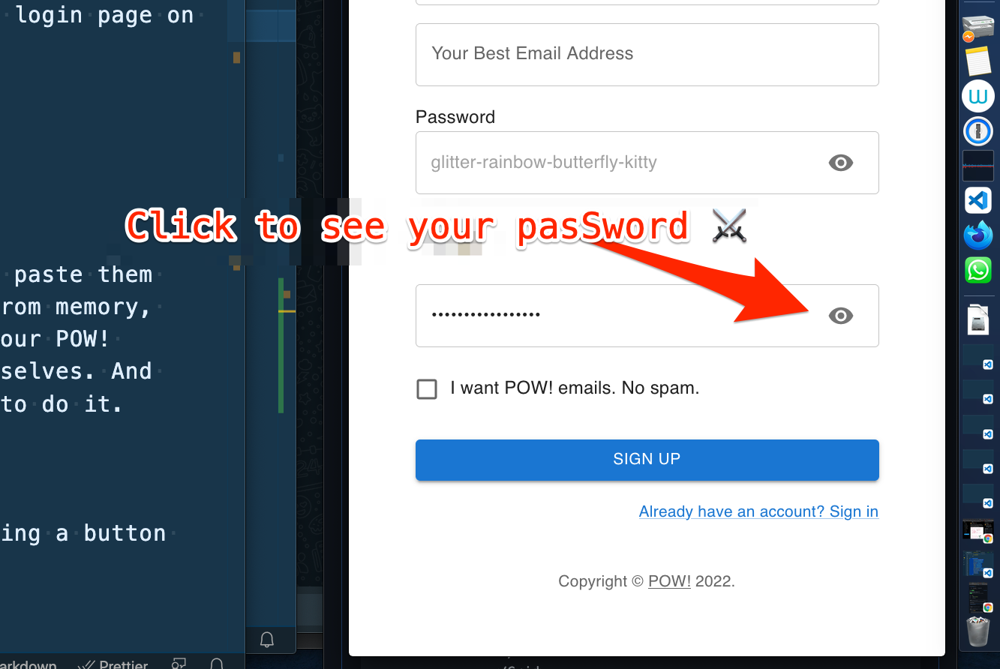

## My Sunday Skill Builder Session:

This Sunday, I made Password Peek-a-boo on the login page on our POW!-website. So now we're showing you your password if you poke the eye icon inside the password field. Later we will use that login page on the POW! app

## What did I do?
POW! Password Peek-a-boo


## Why did I do it?

I like to see my pasSwords when I copy paste them from 1Password and when I write them from memory, because I am a visual guy. So we want our POW! customers to be able to chose for themselves. And because Queen Benedicte @raae told me to do it.

## How did I do it?

The short version is I started out making a button like this:

```js
              <Grid item xs={12}>
                <IconButton>👁️</IconButton>
              </Grid>
```

And then I added this:
```js
                  aria-label="toggle password visibility"
                  onClick={handleClickShowPassword}
```

For the long version of My Sunday Skill Builder Session:, watch [Sunday's OlaCast on YouTube](https://youtu.be/v00Uro6UQvY)


💪😺👍
Keep your skill-building-ship afloat this week!
⛵🔧🏴‍☠️


Ola Vea
Cap'n of his own skill-builder-ship
