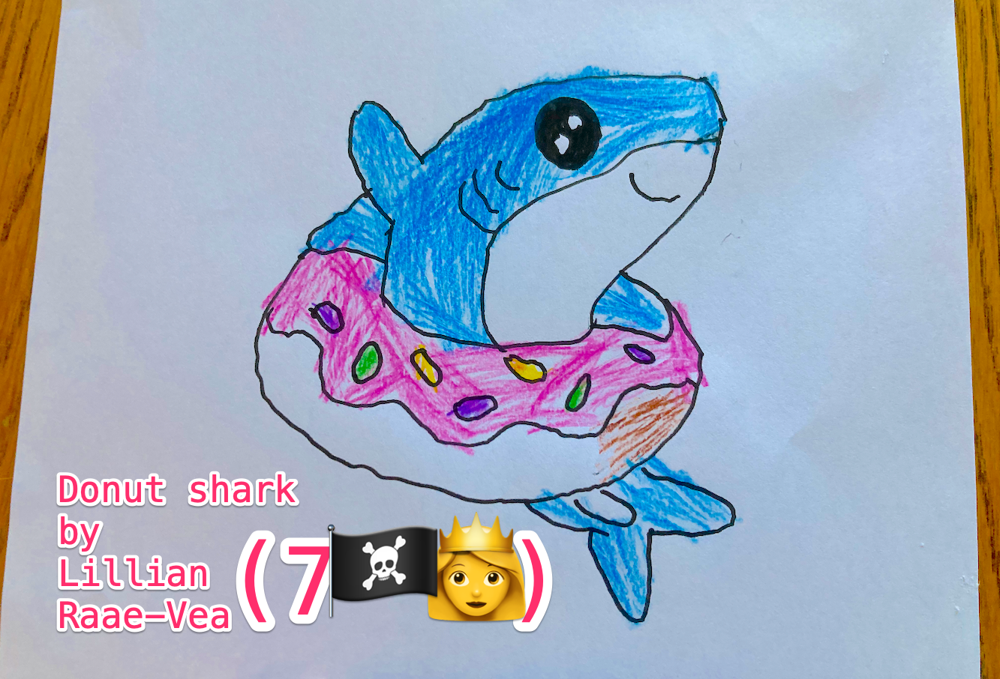

## Adding async await to sourceNodes is a sub-task

In my daily gatsby-plugin practice I do ONLY one sub-task each session. Today's sub-task was:

- adding `async` to `exports.sourceNodes =` and
- `await createCloudinaryNodes(`

I'll soon tell you WHY I do a daily sub-task, but first WHAT is a sub-task?


## WHAT is a sub-task?

You know that dev-task YOU did last week? Close your eyes and see your dev-task as a pink donut. Bite off a useless-on-it's-own sub-task. NOW you can chew it. Without Choking on it, as you might choke on the whole donut. *



## HOW do you find your sub-task?

A. Look up again a dev-task you did last week

B. Bite off a useless-on-it's-own sub-task

That's all 😺


## WHY do I do a daily sub-task?

Because MY dev-brain practices more piraty on a tiny sub-task than on the whole dev-task.


## Here is my code before practice

```js
// gatsby-node.js

const piraty = `source piraty api here`

const createPiratyNodes = async (gatsbyUtils) => {
  console.log(`create Piraty Nodes here`)
}

// Add async

exports.sourceNodes = (gatsbyUtils) => {

    // Add await

  createPiratyNodes(
    gatsbyUtils,
    piraty,
  );
};


```

## After practice
```js
// gatsby-node.js

const piraty = `source piraty api here`

const createPiratyNodes = async (gatsbyUtils) => {
  console.log(`create Piraty Nodes here`)
}

// Add async

exports.sourceNodes = async (gatsbyUtils) => {

    // Add await

  await createPiratyNodes(
    gatsbyUtils,
    piraty,
  );
};

```

Try out a sub-task on your own dev-brain, it might make your practice more piraty 🏴‍☠️😺👍

ARR!

&nbsp;

Stay piraty 🏴‍☠️😺👍 and keep practicing!


Cap'n Ola Vea

P.S
Next plugin-pirate letter will be about "How do you know what type of sub-task is right to bite off for your dev-brain?"

* Some people CAN chew a whole donut without choking on it. Don't believe me? Dig up the video with Paul Scanlon winning a donut eating contest against a Gatsby co-worker. You'll find the video somewhere [on Paul's twitter.](https://twitter.com/PaulieScanlon)

Read more about adding async await to sourceNodes in Queen @raae's email [Remember to await node creation! ⏳ ⌛️](https://queen.raae.codes/emails/2022-05-25-await-node-creation/)