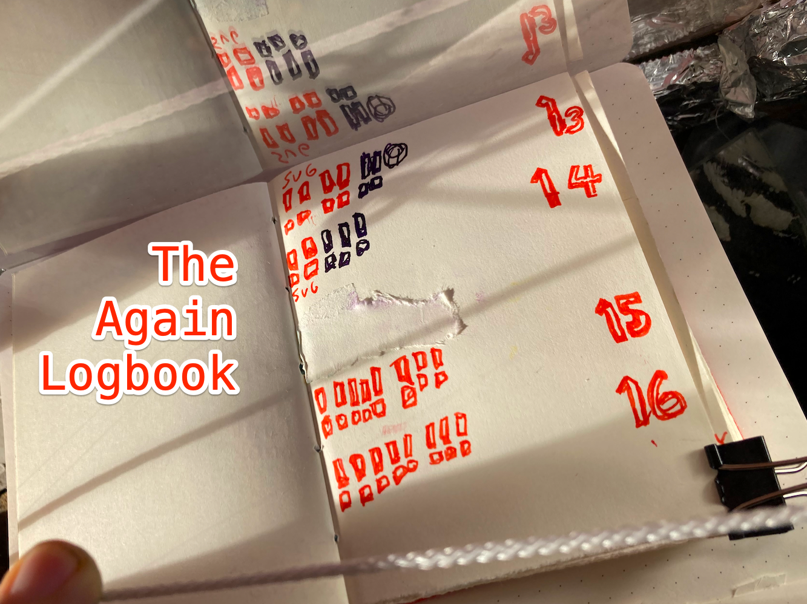

Ahoy skill-builder pirate of Jamstackia!

👋😸🏴‍☠️

We looked into "my favourite focus tool to find out when your sub-task practice session is done, the croco-clock 🐊-⏲️" in my last letter so today I'll show you The Again Logbook 📕. We'll look at:

* What The Again Logbook 📕 is,
* Why it can help you to do your sub-task again and again
* How you use The Again Logbook 📕

##  WHAT is The Again Logbook 📕?

The Again Logbook is for example a little red notebook. Here is mine, The Queen bought it for me in Greece.

## WHY could The Again Logbook 📕 help you to do your sub-task again and again?
Firstly you decide to automate your sub-task into your dev-brain. This is good for your motivation. Your personal value increase with each sub-task you have  automated into your dev-brain.

Secondly by deciding to do your sub-task for example six times you confirm to yourself your decision to automate your sub-task into your dev-brain.

Thirdly if you give up before you have done your sub-task six times you loose.

## HOW do you use your Again Logbook? 📕

1. You set your croco-clock 🐊-⏲️ to for example 96 minutes
2. You make a row of tiny squares, for example six.
3. That is the number of times you decide to do your sub-task again
4. For each time you finish you sub-task you turn one tiny square into an "!"
5. Keep doing your sub-task again and again until your croco-clock 🐊-⏲️ goes ARRR! even past your six times, but keep making a new "!" each time
6. Because doing them more times than you planned feels like winning

Yo-Ho-Ho and a bottle of GO! 😺

## TODO

Write up a sentence about your Again Logbook 📕 experiments and email it to Lillian (7 🏴‍☠️👸) and me, that would help us a lot!

 🏴‍☠️😺👍

ARR!

&nbsp;

Stay piraty 🏴‍☠️😺👍 and keep practicing!

Cap'n Ola Vea

