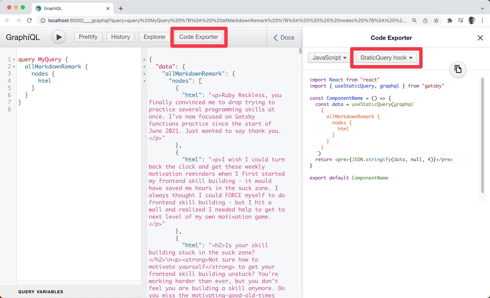

Working through Mirjam's markdown homework on [yesterday's stream](https://youtu.be/LcpLKXgfNNo), I remembered how empowered I felt when I found out there is an **Export code** feature in Gatsby's GraphiQL.

I decided to pay it forward, and our Great and Powerful Pirate Guest, [Swizec](https://twitter.com/Swizec) was flabbergasted...

> Wow, is that new? That is so cool!

You can choose to export:

- Page Query code

- StaticQuery hook code

- or StaticQuery component code

Did you know?  
Do you use it?

&nbsp;  
All the best,  
Queen Raae

&nbsp;  
**PS:** If you would like to be notified 30 minutes before the next stream, sign up for [stream reminders](/emails/reminders).
