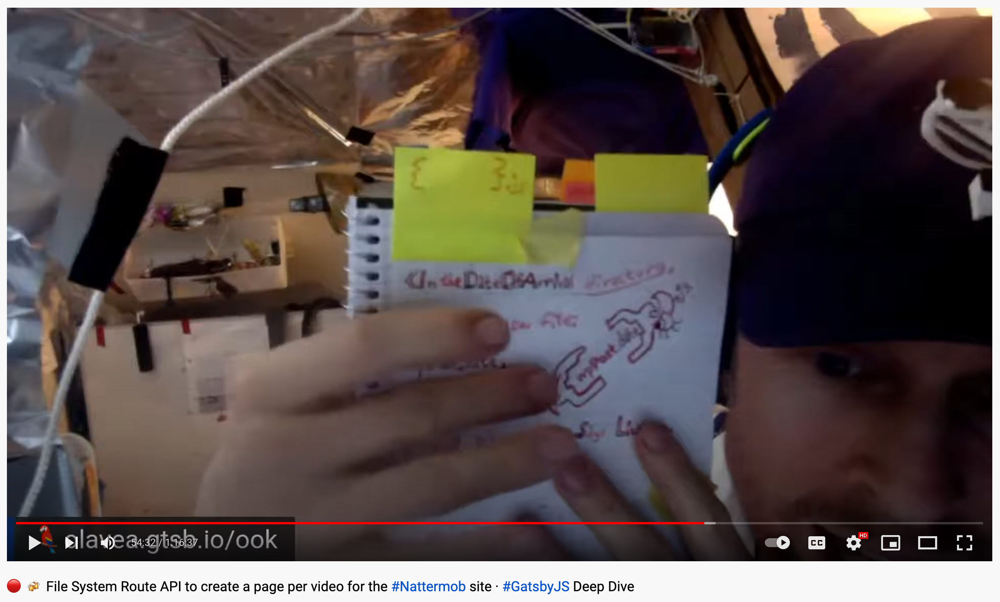

In the sharky waters around the Gatsby islands, we call the File System Route API SSG pages for Parrot Pages 🦜 as mentioned in Tuesday's email about [SSG with Gatsby](/emails/2022-01-11-ssg/).

Making abstract concepts like that come alive is one of Cap'n Ola Vea's superpowers.

Hear him present the naming to Ward Peters of Gatsby [in this live stream](https://youtu.be/TX5XPuHhz9o?t=3265) all about Parrot Pages.

What imagery would you choose for the [File System Route API](https://www.gatsbyjs.com/docs/reference/routing/file-system-route-api/#creating-client-only-routes) square bracket (`[]`) pages?

For a demonstration of both Parrot Pages and square bracket (`[]`) pages side-by-side, check out the demo for [SSR Fallback routes with Gatsby](https://codesandbox.io/s/demo-ssr-fallback-route-9pteu?file=/README.md).

&nbsp;  
All the best,  
Queen Raae
