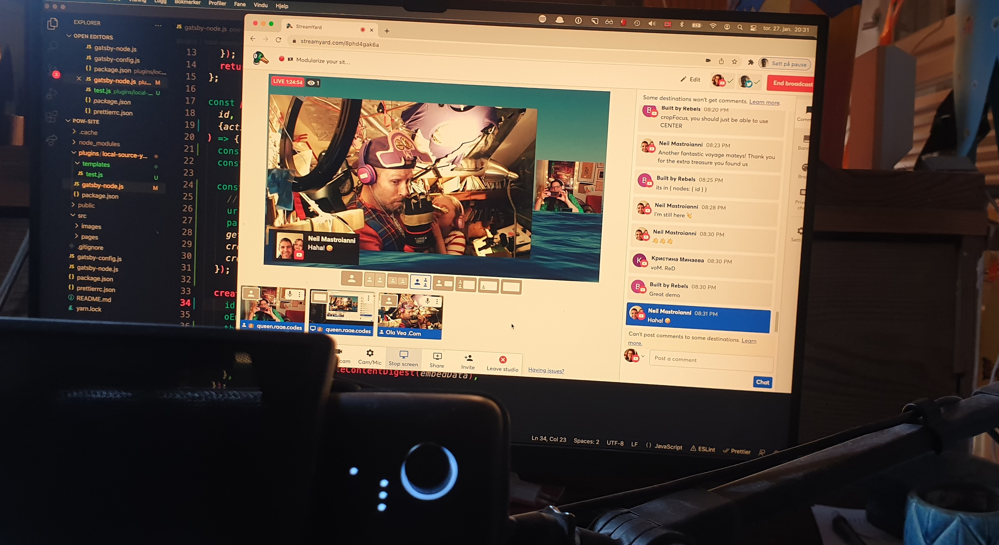

In yesterday's unauthorized and rum-fueled treasure hunts in the sharky waters around the Gatsby islands we looked at how to [modularize your project](https://youtu.be/26CDRdhXozo) with local plugins.

[](https://youtu.be/26CDRdhXozo)

I've added timestamps to the description, so you can jump straight to [the why](https://youtu.be/26CDRdhXozo?t=261) or [the how](https://youtu.be/26CDRdhXozo?t=520) if you'd like.

The TLDR version of _why_: [I like a tidy ship](https://youtu.be/26CDRdhXozo?t=1446)

To create a local plugin, add a `plugins`-folder to your project. Inside create a folder for your plugin with an empty package.json file. The name of your plugin will be the same as the name of this folder.

To use your local plugin, add it to your plugins array the same way you would external plugins.

I recommend using the Gatsby pattern for naming plugins but replace `gatsby-` with `local-` to make it super clear when looking at your gatsby-config that it's a local plugin. Otherwise, it's an easy mistake to go look for it on the npm registry.

## Local Plugin Example

With the folder structure:

```
gatsby-project/
├─ src/
│  ├─ <all your regular stuff>
├─ plugins/
│  ├─ local-source-youtube/
│  │  ├─ package.json
│  │  ├─ gatsby-node.js
├─ gatsby-config.js
├─ package.json
```

you may configure the local plugin like so:

```js
module.exports = {
  plugins: [
    {
      resolve: "local-source-youtube",
      options: {
        youTubeIds: ["Bk1jonYPFD4", "TzJfepDjpzM"],
      },
    },
  ],
};
```

You may also check out the code in the [stream work](https://github.com/olavea/pow-site/commits/stream-work) branch of the new pow-site repo.

&nbsp;  
I hope you found this helpful!  
Let me know either way 🙏

&nbsp;  
All the best,  
Queen Raae

&nbsp;  
**PS:** We got done super fast but kept on YOLO streaming. Check the [YouTube description](https://youtu.be/26CDRdhXozo) for timestamps to all the things.
