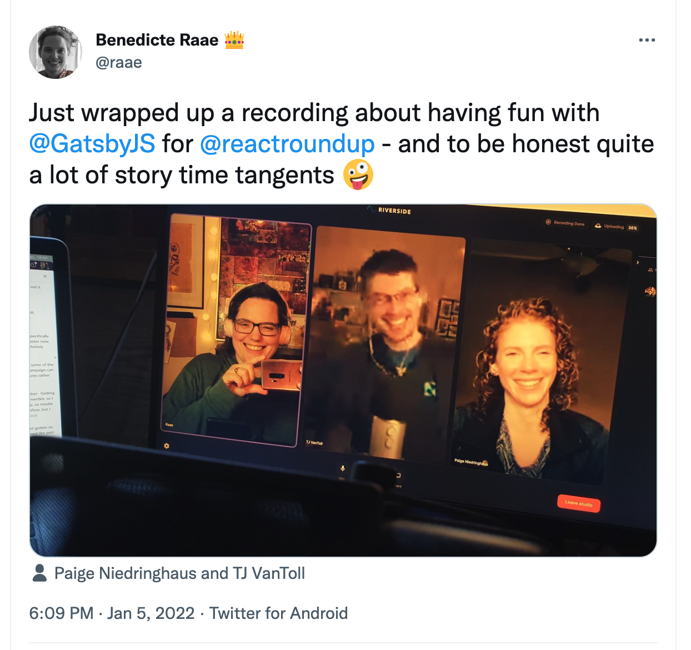

I had so much fun chatting to these two about Gatsby and my overall web journey: 25+ years and counting 👵

The episode has dropped, and I love the title: The Great Gatsby with Queen Raae 😍

_Interested to learn more about this “Great Gatsby”? How does it differ from others, and where is the industry headed? Time for a meeting with the Queen! The React team sits down with Queen Benedicte Raae, a software developer and overall coding wizard in this episode. They discuss the ONE feature of Gatsby that makes it so beginner friendly, what Queen Raae learned from her years of Wordpress and web building, and where they believe the conversation of “no-code vs code everything” is headed._

[LISTEN NOW ▶️](https://reactroundup.com/the-great-gatsby-with-queen-raae-react-168)

&nbsp;  
**Sharing is caring!**

Please consider sharing this episode with a friend who might like it if you find this episode helpful. Thanks!

&nbsp;  
All the best,  
Queen Raae
