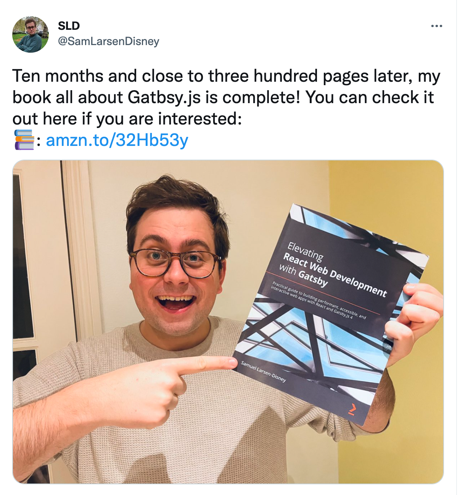

Netlify released support for Gatsby SSG and DSG today 🎉 It's been in beta since September, but this is the first stable release. Check out [their announcement](https://github.com/netlify/netlify-plugin-gatsby/releases/tag/v2.0.0) for more information.

Gatsby is still hard at work with their Gatsby Conf, and you have until tomorrow 08:59 CET to enter the Gatsby Best of 2021 Agency Awards.

Gatsby released [version v4.6](https://www.gatsbyjs.com/docs/reference/release-notes/v4.6/) last week. Is it just me, or are these coming more often than before? Personally, I am excited about [the markdown image fix](https://www.gatsbyjs.com/docs/reference/release-notes/v4.6/#tracking-image-changes-in-markdown-files) 🖼

And last but not least, Samuel Larsen-Disney released his book [Elevating React Web Development with Gatsby: Practical guide to building performant, accessible, and interactive web apps with React and Gatsby.js 4](https://twitter.com/SamLarsenDisney/status/1487112270782025731?s=20&t=Yl7K-g2Iz1rrZTRHHm65Cw). That is one very long and promising title; I can't wait to dig in!

## Our streaming schedule this week

- [🔴 🏴‍☠️ Create your own plugin using @raae/gatsby-plugin-starter · #GatsbyJS Deep Dive](https://youtu.be/eaZm9MC0GeE)&nbsp;—&nbsp;Thursday, February 3rd @&nbsp;19:00&nbsp;CET
- [🔴⛵ TBD - Time might change · #OlaCast · Sunday #16](https://youtu.be/otRx6U5zASw)&nbsp;—&nbsp;Sunday, February 6th

## Other events

- [How Glean Grew Organic Traffic by 60% with Gatsby + Strapi CMS](https://www.gatsbyjs.com/resources/webinars/strapi-glean-seo/)&nbsp;—&nbsp;Thursday, February 3rd @&nbsp;17:00&nbsp;CET&nbsp;·&nbsp;Gatsby

&nbsp;  
All the best,  
Queen Raae

&nbsp;  
**PS:** Let me know if you have something I should include next week!
