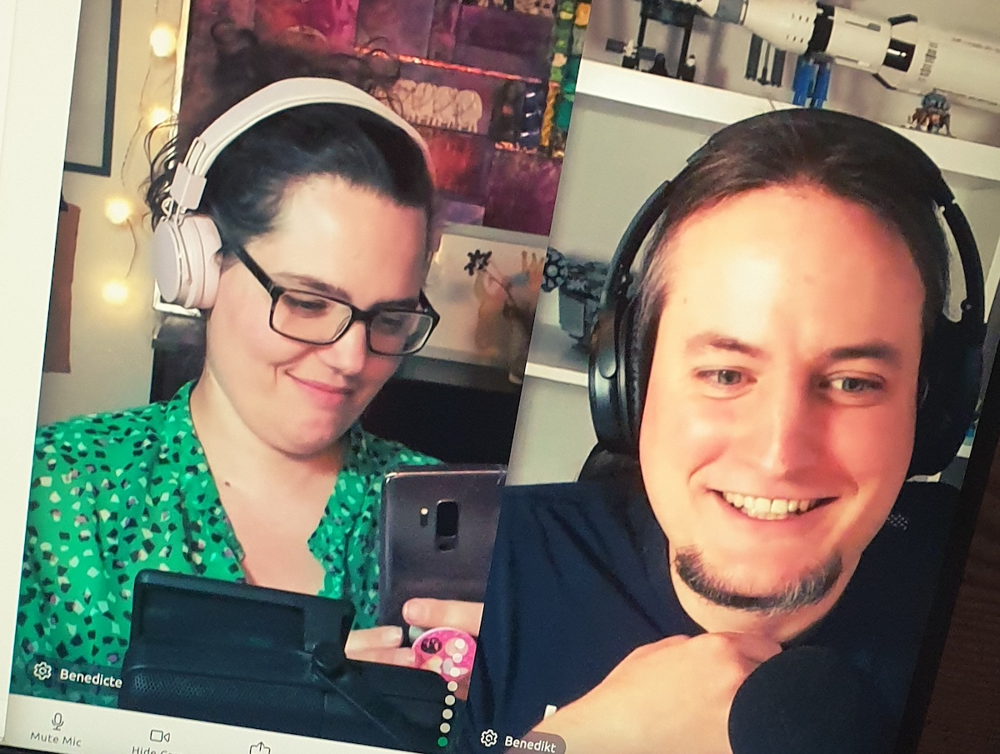

Did you know I co-host a podcast?

Last summer, I was interviewed by Benedikt of Userlist on my live streaming shenanigans for his and Brian's podcast Slow&Steady.

A podcast all about building products in public!

Long story short, a few episodes later, I became a co-host.

Give it a listen if you would like a backstage view of Queen Raae; learn more about POW! — the privacy-first menstrual cycle journal (my SaaS made with Gatsby, of course 🤣) and/or Benedikt's Userlist journey.

Once a month-ish, you also get to hear from other product folks we admire. January was [@lesley_pizza](https://twitter.com/lesley_pizza) of Newsletter Glue. Later this month, we interview [@threehourcoffee](https://twitter.com/threehourcoffee) of Llama Life, and in March, it's [@steveruizok](https://twitter.com/steveruizok) of tldraw.com.

## Some episodes to get you started:

- My first episode as a guest all about [live streaming](https://www.slowandsteadypodcast.com/episodes/live-streaming-with-benedicte-raae)
- Get to know our backstories on episode [🥳 100! 🥳](https://www.slowandsteadypodcast.com/episodes/100)
- [The Interview](https://www.slowandsteadypodcast.com/episodes/newsletter-glue-with-lesley) with our first guest of the year, Lesley

&nbsp;  
All the best,  
Queen Raae

&nbsp;  
**PS:** Slow&Steady recently became a [YouTube Channel](https://www.youtube.com/channel/UCClPRy5lP1KHqtxZPJbtfBg) as well!
