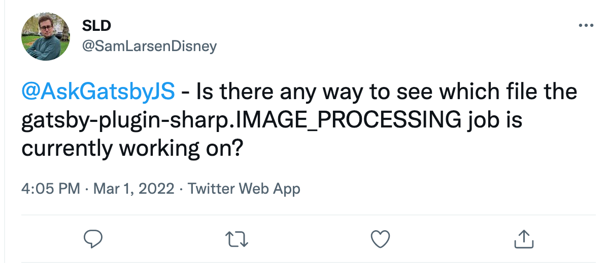
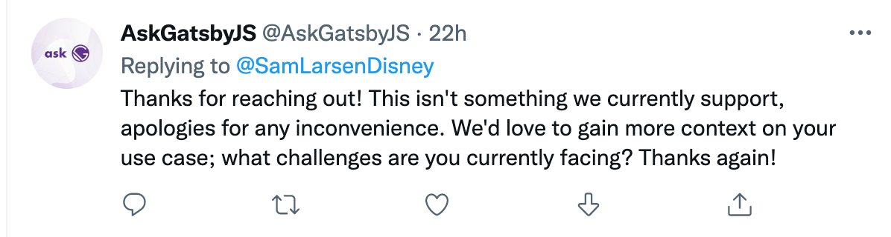
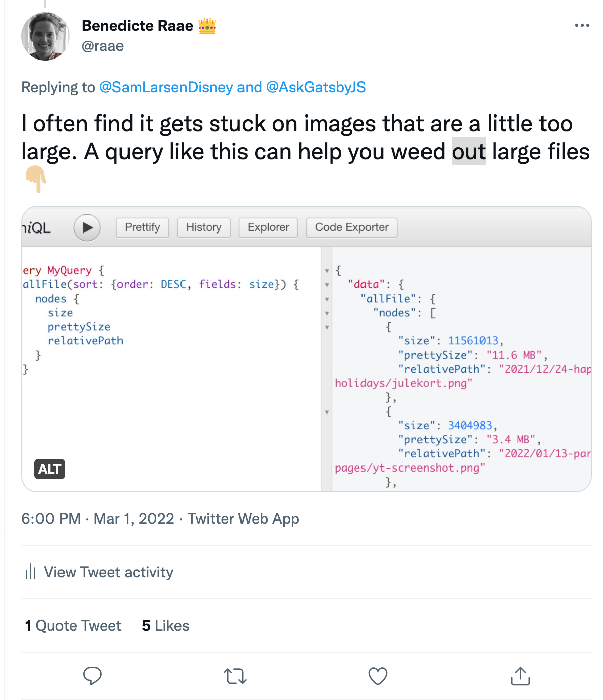

Sam Larsen Disney asked on Twitter:

[](https://twitter.com/SamLarsenDisney/status/1498675878485807113)

It turns out there is not:

[](https://twitter.com/AskGatsbyJS/status/1498697711134126086)

However, when I have experienced sharp processing hanging, there is always a huge image file hanging around somewhere. Not sure how large is large, but to find your larger files, you can run this query:

```graphql
query MyQuery {
  allFile(sort: { order: DESC, fields: size }) {
    nodes {
      size
      prettySize
      relativePath
    }
  }
}
```

And in doing so myself, I see last year's Christmas card/drawing could be a tad bit smaller 🎄

[](https://twitter.com/raae/status/1498705093348241409)

&nbsp;  
All the best,  
Queen Raae
