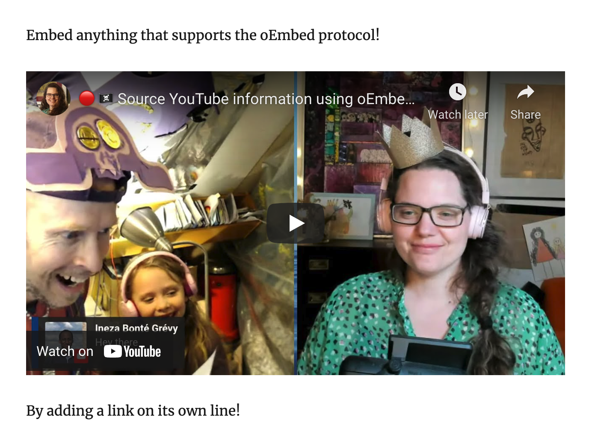

As mentioned [yesterday](/emails/2022-04-25-this-week/) I plan to get a good chunk of work done on the next version of the [gatsby-remark-oembed](https://github.com/queen-raae/gatsby-remark-oembed) plugin this week.

But you might wonder what even is that and how does it work?

## What is Gatsby Remark oEmbed?

The goal of Gatsby Remark oEmbed is to let you drop in a link to embeddable content:

```md
Embed anything that supports the oEmbed protocol!

https://youtu.be/VhrOe0X_oA8

By adding a link on its own line!
```

And have it show up like so on your Gatsby site:



## How does it work?

The plugin is a [gatsby-transformer-remark](https://github.com/gatsbyjs/gatsby/tree/master/packages/gatsby-transformer-remark) sub-plugin. Meaning it will only do work on MarkdownRemark-nodes.

For each MarkdownRemark-node Gatsby Remark oEmbed finds the standalone links, checks the oEmbed provider list for a match, and swaps the link out for the result coming back from the matching provider's oEmbed endpoint.

In the example above, that means swapping:

```
https://youtu.be/VhrOe0X_oA8
```

with the `html`-value of the oEmbed response from YouTube:

```json
{
  "title": "\ud83d\udd34 \ud83c\udff4\u200d\u2620\ufe0f Source YouTube information using oEmbed, no YouTube API Key needed \u00b7 #GatsbyJS Deep Dive",
  "author_name": "Queen Raae",
  "author_url": "https://www.youtube.com/c/QueenRaae",
  "type": "video",
  "height": 113,
  "width": 200,
  "version": "1.0",
  "provider_name": "YouTube",
  "provider_url": "https://www.youtube.com/",
  "thumbnail_height": 360,
  "thumbnail_width": 480,
  "thumbnail_url": "https://i.ytimg.com/vi/VhrOe0X_oA8/hqdefault.jpg",
  "html": "\u003ciframe width=\u0022200\u0022 height=\u0022113\u0022 src=\u0022https://www.youtube.com/embed/VhrOe0X_oA8?feature=oembed\u0022 frameborder=\u00220\u0022 allow=\u0022accelerometer; autoplay; clipboard-write; encrypted-media; gyroscope; picture-in-picture\u0022 allowfullscreen\u003e\u003c/iframe\u003e"
}
```

that we got by calling YouTube's oEmbed endpoint with the original standalone link: https://www.youtube.com/oembed?url=https://youtu.be/VhrOe0X_oA8.

&nbsp;

- If this sounds interesting to you and you would like to contribute, shoot me a reply, and I'll loop you in!

&nbsp;  
All the best,  
Queen Raae
