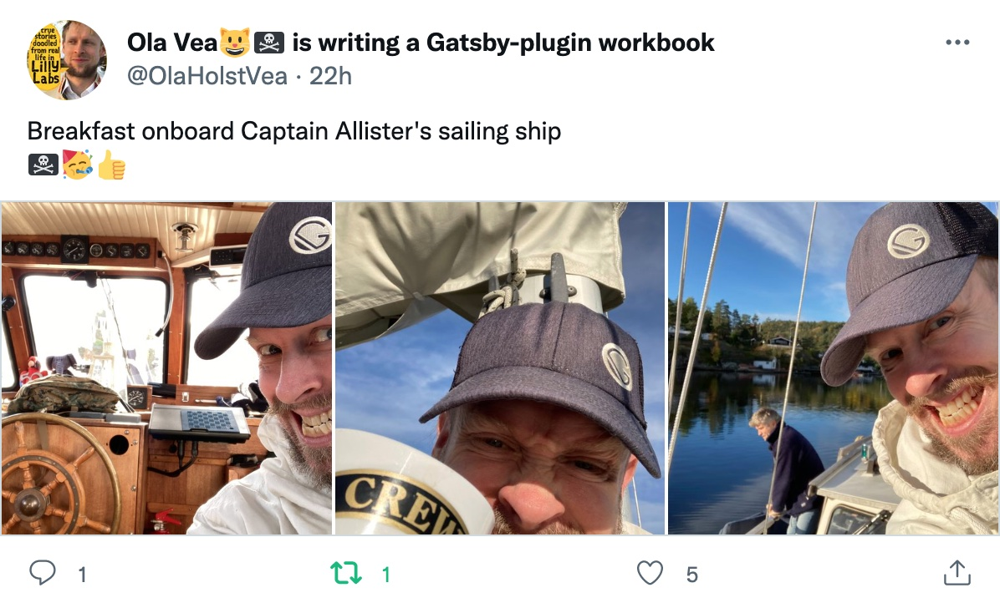

This week [Cam Sloan](https://twitter.com/SloanCam) climbs onboard, and we'll use his product [Hopscotch](https://hopscotch.club/) to add a product tour to [Prune your follows](https://prune.raae.tech/). I think this will be a fun one!

Lillian and I had an action-packed week of family fun in Heidelberg last week. But I also got some grown-up time with [Mirjam](https://twitter.com/mirjam_diala), who you might know from our [Conference Buddy](https://www.conferencebuddy.io/) streams last Christmas. Check out the [playlist on YouTube](https://youtube.com/playlist?list=PL9W-8hhRoLoNpEj71YsWChzOAocHiGZB4). We forgot to take a picture, so did it really happen?!

Ola, on the other hand, went sailing again ⛵️

Also, Gatsby released [v4.24](https://gatsbyjs.com/docs/reference/release-notes/v4.24) at the end of September.

## Our streaming schedule this week

🔴 🏴‍☠️ [Gatsby + Hopscotch with Hopscotch founder Cam Sloan · #GatsbyJS Deep Dive](https://youtu.be/yDxF8FUNUbI)  
— Thursday, October 13th @ 19:00 CEST

## Other events

[React Router 6.4 with Ryan Florence (Learn with Jason)](https://www.learnwithjason.dev/react-router-6-4)  
— Tuesday, October 11th @ 19:30 CEST

&nbsp;

All the best,  
Queen Raae

&nbsp;

**PS:** What are your thoughts on the new meme approach to social media Gatsby is taking?
