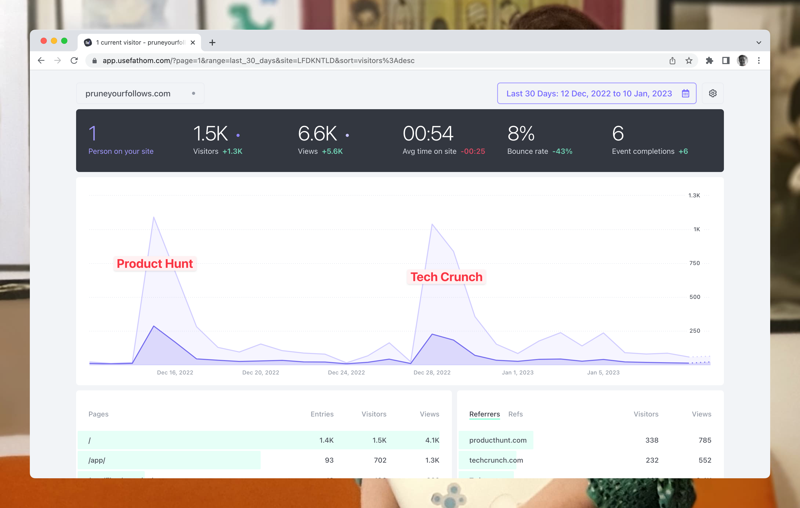

Yes, in roughly equal amounts. But of course, without a Product Hunt, there would probably not have been a Tech Crunch article.

[Prune your Follows](https://pruneyourfollows.com/) came in as the 13th product of the day, showing that even when missing the elusive top 10, a Product Hunt launch can still have an add-on effect.

Things change a little by looking at the traffic directly from the two sources. Product Hunt does not have much of a long tale, but it seems Tech Crunch might.

🤦‍♀️ We do not track the signup dates, so I cannot give you a pretty graph of the signups. However, I followed the numbers of users in the database pretty closely during both events, and the traffic peaks corresponded to a spike in new users.

**Note to self for next time:** Either make sure to track signup dates or, better yet, use a tool like [LogSnag](https://logsnag.com/), and I'd have a pretty graph to show out of the box.

Current status:

- 820 users
- 13.767 unfollows facilitated
- 308 emails collected

&nbsp;

All the best,\
Queen Raae

**PS:** You may play with the [analytics yourself on Fathom](https://app.usefathom.com/share/lfdkntld/pruneyourfollows.com)
