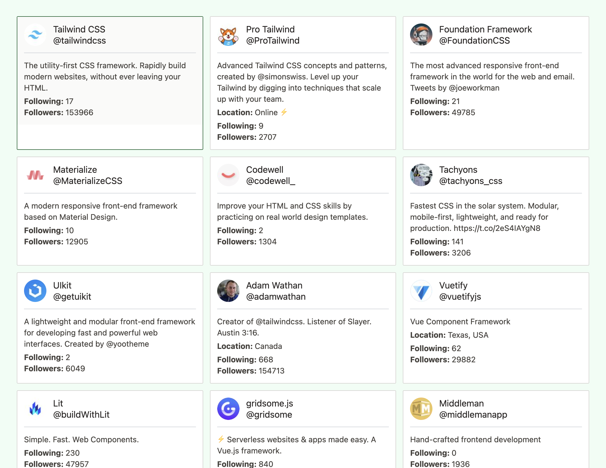

In this week's unauthorized and rum-fueled treasure hunt, we explored how to use [semantic search](/emails/2023-03-21-semantic-search/) to find similar Twitter accounts to a selected account.

We think it might be a helpful feature for Prune you Follows. Either the user selects an account, or we look at already unfollowed accounts and suggest new ones.

[](https://www.youtube.com/live/VrpOFeWbz5M?feature=share)

It's promising, but when looking for similar accounts to the Tailwind founder Adam, we're not really looking for others named Adam 🤔


But sometimes, there is important info in the account name, especially for accounts representing non-humans, such as the Tailwind account.



However, the Adam case might be because he has an undetailed description. His co-founder Steve does not give us as many Steves...


For this exploration, we used embeddings created by [OpenAI](https://platform.openai.com/docs/api-reference/embeddings) from the input:

```js
const input = `
    Name: ${account.name};
    Username: ${account.username};
    Location: ${account.meta.location};
    Description: ${account.meta.description};
    Followers: ${account.public_metrics.followers_count};
    Following: ${account.public_metrics.following_count};
`;
```

> From a data point of view, embeddings are simply arrays of floats. They are the output of ML models, where the input can be a word, a sentence, a paragraph of text, an image, an audio file, a video file, and so on.

> Each number in the array of floats represents the input text on a particular dimension, which depends on the model. This means that the more similar the embeddings are, the more "similar" the input objects are. I've put "similar" in quotes because it depends on the model what kind of similar it means. When it comes to text, it's usually about "similar in meaning", even if different words, expressions, or languages are used.

<cite>[Tudor Golubenco (CTO of Xata)](https://xata.io/blog/semantic-search-openai-typescript-deno)</cite>

&nbsp;

All the best,\
Queen Raae

```

```
