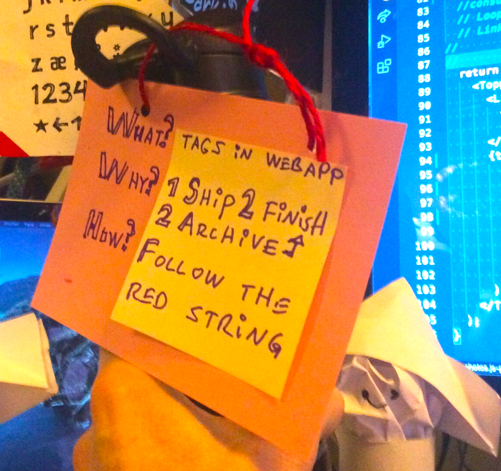

Subject:

⛵️ Programatically create pages for tags from Sanity.io

Ship Ahoy Skill Builder!

## My Sunday Skill Builder Session:

## What did I do?
I followed the "red string" of one tag from the front end of the webapp and all the way back to my backend in sanity.io.

## Why did I do it?
I want to use tags in a way that make it easier for Lillian (7 🏴‍☠️👸) to finish her projects by shipping them to the internet. And then archiving her projects on my labyrinthine loft. Because it is good for skill building to finish projects. My definition of "finished" is:
1 Ship 2 finish
2 Archive 2 finish

## How did I do it?

## The Steps
See this two minute summary where I followed the "red string" of one tag from the frontend of the webapp and all the way back to my backend in sanity.io.

[Ola follows the "red string" near the end of 🏴‍☠️ OlaCast: Sunday Skill Builder Session](https://youtu.be/ix_0vrwQnWk?t=1200)

If you feel like doing me a favour you can give me a 🏴‍☠️ emoji comment to feed my youtube algos some vitamins.

💪😺👍

Keep your skill-building-submarine afloat this week!
🔧⛵🏴‍☠️

Cap'n Ola Vea

