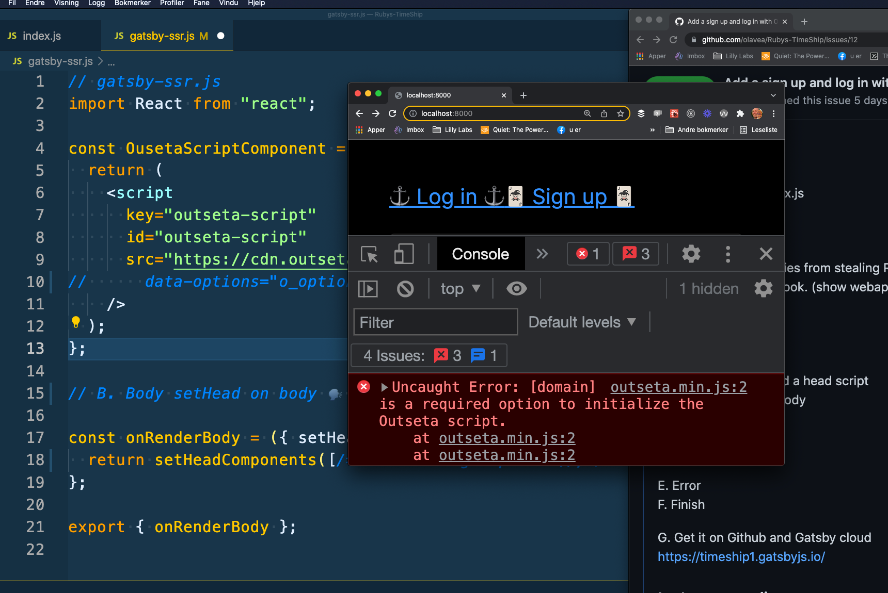

Subject:
Add login and sign up to Ola's webapp with Outseta

Ship Ahoy Skill Builder!

## One of my tiny tasks this week was:

– Add login and sign up to Ola's webapp with Outseta

## What did I do?

I added a log in and sign up to my TimeShip Gatsby website. Both are pop ups. I used Outseta and Queen 👑 Raae's help. See P.S. for my finished code and link to youtube show.

## Why did I do it?

To stop Lizabeth's enemies from stealing Ruby's TimeShip. See P.S. for drawings of Her Murderous Majesty Mary and Simona "Red Fox" Renard.

## How did I do it?

**The Plan**
A. Anchors: add anchors and a head script ⚓ + 🗣️
B. Body: setHead on body ⛄

C. Config
D. Domain

E. Error
F. Finish

G. Get on Gatsby cloud with Github 🌩️

## The Steps

### A. Anchors: add anchors and a head script ⚓ + 🗣️

```js

// src / pages / index.js
      <section>
        <a href="https://queen.outseta.com/auth?widgetMode=login#o-anonymous">
            ⚓ Log in ⚓
        </a>
        <a href="https://queen.outseta.com/auth?widgetMode=register#o-anonymous">
            🃏 Sign up 🃏
        </a>
      </section>
```

### B. Body: setHead on body ⛄

I added this code to my gatsby-ssr.js. I then asked Terminal-Tor to kill my process and I re-ran gatsby develop and looked at localhost. I got an error, see step E. Error for screenshot.

```js
// gatsby-ssr.js
import React from "react";

const OusetaScriptComponent = () => {
  return (
    <script
      key="outseta-script"
      id="outseta-script"
      src="https://cdn.outseta.com/outseta.min.js"
//      data-options="o_options"
    />
  );
};

// B. Body setHead on body

const onRenderBody = ({ setHeadComponents }) => {
return setHeadComponents([/*OusetaConfigComponent(),*/ OusetaScriptComponent()]);
};

export { onRenderBody };
```

### C. Config

I added this code to my gatsby-ssr.js.

```js
// gatsby-ssr.js

const OusetaConfigComponent = () => {
  const config = {
    domain: "queen.outseta.com",
    monitorDom: true,
  };
  return (
    <script
      key="outseta-config"
      id="outseta-config"
      dangerouslySetInnerHTML={{
        __html: `var o_options = ${JSON.stringify(config, null, 2)}`,
      }}
    />
  );
};
```

### D. Domain

I un-commented these comments in my gatsby-ssr.js. I then asked Terminal-Tor to kill my process and I re-ran gatsby develop and looked at localhost.

```js
// gatsby-ssr.js
//      data-options="o_options"
/*OusetaConfigComponent(),*/

```

### E. Error is gone

The error I got was before steps C. and D. here is a screenshot:



### F. Finished

– I re-coded the code in steps A. to D.
– I re-coded the code in steps A. to D.
– I re-coded the code in steps A. to D.
💪😺👍

### G. Get on Gatsby cloud with Github

https://timeship1.gatsbyjs.io/


Keep your skill-building-submarine afloat this week!
🔧⛵🏴‍☠️

Ola Vea
Gatsby Piraty Captain

P.S.

## My finished code

```js
// gatsby-ssr.js
import React from "react";

const OusetaScriptComponent = () => {
  return (
    <script
      key="outseta-script"
      id="outseta-script"
      src="https://cdn.outseta.com/outseta.min.js"
      data-options="o_options"
    />
  );
};

const OusetaConfigComponent = () => {
  const config = {
    domain: "queen.outseta.com",
    monitorDom: true,
  };
  return (
    <script
      key="outseta-config"
      id="outseta-config"
      dangerouslySetInnerHTML={{
        __html: `var o_options = ${JSON.stringify(config, null, 2)}`,
      }}
    />
  );
};

// B. Body setHead on body

const onRenderBody = ({ setHeadComponents }) => {
  return setHeadComponents([OusetaConfigComponent(), OusetaScriptComponent()]);
};

export { onRenderBody };

```


Links:
[Ruby's TimeShip](https://timeship1.gatsbyjs.io/)
[Add login and sign up to Ola's webapp with Outseta and Queen Raae on youtube](https://youtu.be/8akVGSk4FhQ)
[Outseta Website](https://www.outseta.com/)
Outseta on twitter [@outseta](https://twitter.com/outseta)

To look at this doc you need to sign up for a free Outseta plan
https://timeship.outseta.com/#/app/auth/embeds/quickstart


Mary 1
(Her Murderous Majesty of Britannia)


Simona "Red Fox" Renard
(Queen Mary's Super Spy)


Simona "Red Fox" Renard
(Queen Mary's Super Spy)

and

Captain Kitten
(Famous baker apprentice)


