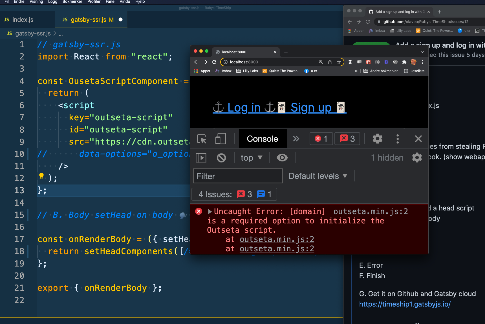

## One of my tiny tasks this week was:

- Add "pop-up" login and sign up to a Gatsby webapp with Outseta

## What did I do?

I added the Outseta login and sign up to my skillbuilding Gatsby project: Ruby's Timeship. I didn't manage to get all the way, so I asked for help and Queen Raae 👑 came on [this week's OlaCast on YouTube](https://youtu.be/8akVGSk4FhQ).

## Why did I do it?

To stop Lizabeth's enemies from stealing Ruby's TimeShip.

## How did I do it?

### The Plan

A - Anchors: add anchors ⚓ and a head script 🗣️  
B - Body: setHead on body ⛄

C - Config  
D - Domain

E - Error  
F - Finish

G - Get on Gatsby cloud with Github 🌩️

## The Steps

### A - Anchors: add anchors ⚓ and a head script 🗣️

```js
// src / pages / index.js
<section>
  <a href="https://queen.outseta.com/auth?widgetMode=login#o-anonymous">
    ⚓ Log in ⚓
  </a>
  <a href="https://queen.outseta.com/auth?widgetMode=register#o-anonymous">
    🃏 Sign up 🃏
  </a>
</section>
```

### B - Body: setHead on body ⛄

I added this code to my gatsby-ssr.js. I then asked Terminal-Tor to kill my process and I re-ran gatsby develop and looked at localhost. I got an error, see step E - Error for screenshot.

```js
// gatsby-ssr.js
import React from "react";

const OusetaScriptComponent = () => {
  return (
    <script
      key="outseta-script"
      id="outseta-script"
      src="https://cdn.outseta.com/outseta.min.js"
      //      data-options="o_options"
    />
  );
};

// B - Body: setHead on body

const onRenderBody = ({ setHeadComponents }) => {
  return setHeadComponents([
    /*OusetaConfigComponent(),*/ OusetaScriptComponent(),
  ]);
};

export { onRenderBody };
```

### C - Config

I added this code to my gatsby-ssr.js.

```js
// gatsby-ssr.js

const OusetaConfigComponent = () => {
  const config = {
    domain: "queen.outseta.com",
    monitorDom: true,
  };
  return (
    <script
      key="outseta-config"
      id="outseta-config"
      dangerouslySetInnerHTML={{
        __html: `var o_options = ${JSON.stringify(config, null, 2)}`,
      }}
    />
  );
};
```

### D - Domain

I un-commented these comments in my gatsby-ssr.js. I then asked Terminal-Tor to kill my process and I re-ran gatsby develop and looked at localhost.

```js
// gatsby-ssr.js
//      data-options="o_options"
/*OusetaConfigComponent(),*/
```

### E - Error is gone

The error I got was after step B:



### F - Finished

- I re-coded the code in steps A to D
- I re-coded the code in steps A to D
- I re-coded the code in steps A to D

💪😺👍

### G - Get on Gatsby cloud with Github

I deployed to Gatsy Cloud: https://timeship1.gatsbyjs.io/

&nbsp;  
🏴‍☠️ ⛵ 🔧  
Keep your skill-building-submarine afloat this week!

Ola Vea  
Gatsby Piraty Captain

&nbsp;  
**Links:**

- [Ruby's TimeShip](https://timeship1.gatsbyjs.io/)
- [This week's stream on YouTube](https://youtu.be/8akVGSk4FhQ)
- [outseta.com](https://www.outseta.com/)
- [@outseta](https://twitter.com/outseta)
