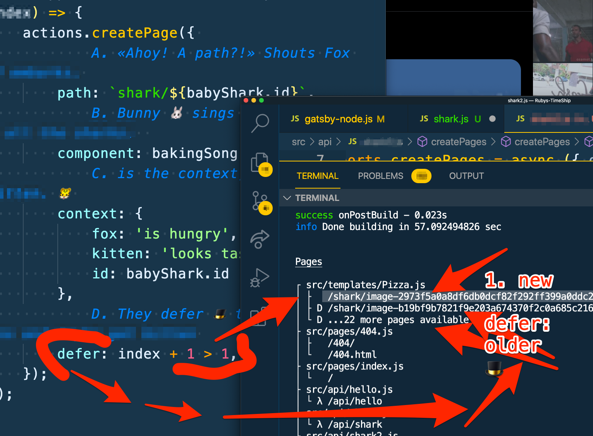

Subject:
Try DSG inside gatsby-node.js

Ship Ahoy Skill Builder!

## One of my tiny tasks this week was:
– Try DSG inside gatsby-node.js

## What did I do?
I did DSG in my TimeShip Gatsby website using Queen 👑 Raee's starter. See P.S. for my finished code.

## Why did I do it?
I want the one latest image page to show up fast and all the older image pages to be generated when a user goes to the url to look at each image page.

Because it fits into the tall tale / children's coloring book I am working on with Lillian (6 🏴‍☠️👸).
we want to show the badly baked gingerbread sharks to _ _ _ "Whitey" Fox, so she will not eat all the good gingerbread sharks. Bad idea.... More about that sometime in the future.


## How did I do it?
**The Steps**
1. I opened gatsby-node.js and set my timer for 1 hour and 36 minutes.
2. I added 🎩 `sort: {🎩, 🙀}` to my graphql query inside GraphiQL first to get the proper syntax
3. I typed it up 🎩 `sort: {🔧, 🙀}` in my graphql query inside gatsby-node.js like this:

```js
    const { data } = await graphql(`{
        supplies: allSanityImageAsset(sort: {       // 🎩
            fields: _createdAt,                     // 🔧
            order: DESC                             // 🙀
        }) {
            nodes {

                id
            }
        }
    }`)                             // gatsby-node.js
```

3. I added 🔧 `_createdAt` to my graphql query like this:

```js
    const { data } = await graphql(`{
        supplies: allSanityImageAsset(sort: {
            fields: _createdAt,
            order: DESC
        }) {
            nodes {
                _createdAt                          // 🔧
                id
            }
        }
    }`)                             // gatsby-node.js
```

4. I added `index` to my `forEach(🦈)` like this:

```js
data.supplies.nodes.forEach((babyShark, index) => {A. B. C. D.}
                                    // gatsby-node.js
```

5. I added `defer:  index + 1 > 1,` to my `createPage({ A. = 🦊,  B. = 🐰, C. = 🐯,  D. = 🎩 })` like this:

```js
        actions.createPage({
            // deleted code for A. = 🦊,  B. = 🐰 and C. = 🐯 se in P.S.
            // D. They Defer 🎩 the good cookies and maybe get bitten
            defer: index + 1 > 1,
        });
                                    // gatsby-node.js
```
6. I build the code and get this in my terminal-Tor:



This means only one page is NOT deferred and that is the page created from my newest image. All older images are on deferred pages. 🎩


7. I did "undo" until my new code was gone
8. I re-coded the code in steps 2. to 5.
9. I re-coded the code in steps 2. to 5.
10.  I re-coded the code in steps 2. to 5.
11.  I re-coded the code in steps 2. to 5.


Keep your skill-building-submarine afloat this week!
🔧⛵🏴‍☠️

Ola Vea
Gatsby Piraty Captain

P.S.

## My finished code

```js
// gatsby-node.js
//              Cap'n Catsby Teaches                              gatsby-node.js
//              Lilly the baker-Bunny to bake
//              baby-Shark-Cookies programatically from
//              Defer-Sharky-Granny's bakingSong with Cap'n Catsby's
//              0. createPages hook
exports.createPages = async ({ graphql, actions }) => {
//              1. bakingSong = Lilly the Bunny requires a recipe
    const bakingSong = require.resolve('./src/templates/Pizza.js');
//              2. Baking supplies = image nodes in Sanity
    const { data } = await graphql(`{
        supplies: allSanityImageAsset(sort: {
            fields: _createdAt,
            order: DESC
        }) {
            nodes {
                _createdAt
                id
            }
        }
    }`)
//    console.log(data.supplies.nodes);
//              3. Loop over the image nodes and for each create a page
    data.supplies.nodes.forEach((babyShark, index) => {
        actions.createPage({
//              A. «Ahoy! A path?!» Shouts Fox 🦊 and embarks.
            path: `shark/${babyShark.id}`,
//              B. Bunny 🐰 sings badly and bakes all the sharks.
            component: bakingSong,
//              C. is the context, a fox hungry for kitten. 🐯
            context: {
                fox: 'is hungry',
                kitten: 'looks tasty',
                id: babyShark.id
            },
//              D. They defer 🎩 the good cookies and maybe get bitten
            defer: index + 1 > 1,
        });
    });
};

```


