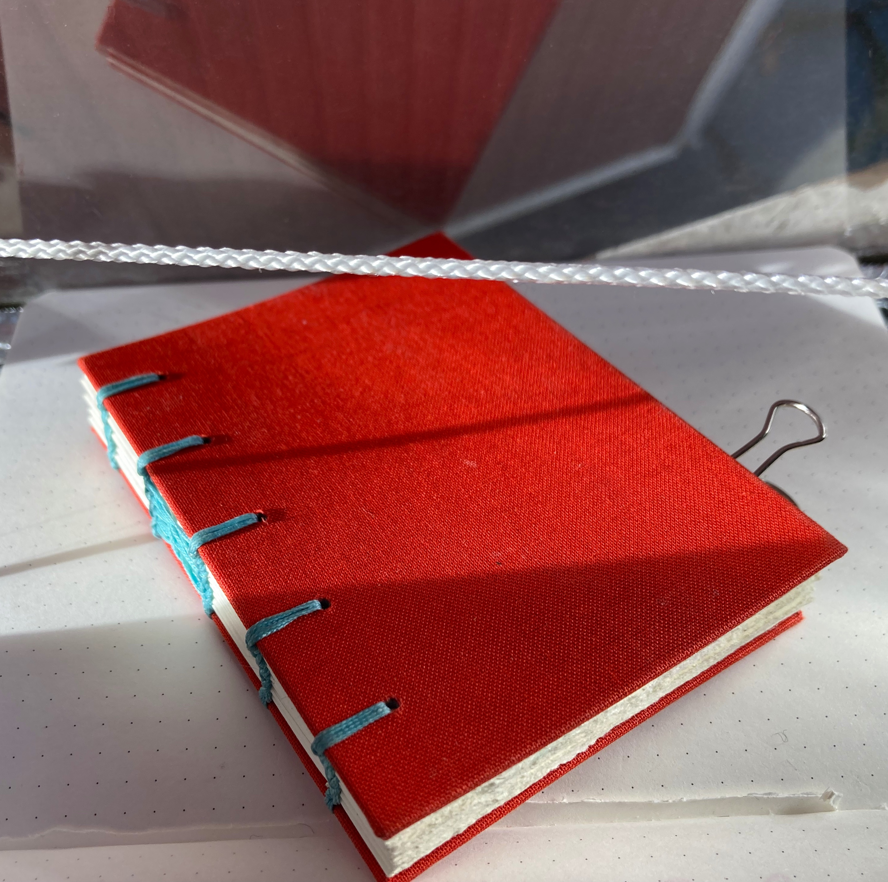
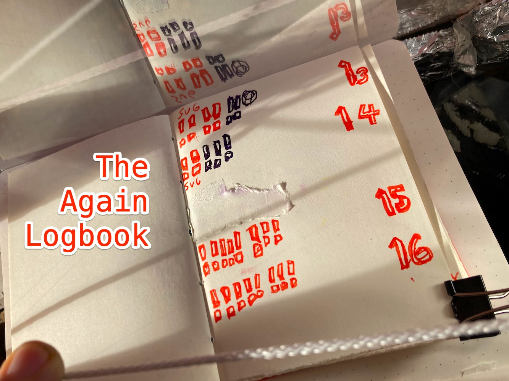

Ahoy, skill-builder pirate of Jamstackia!

👋😸🏴‍☠️

We looked into "my favorite focus tool to find out when your sub-task practice session is done, [the croco-clock 🐊-⏲️](/posts/2022-10-13-croco-clock/)" in my last letter. Today I'll show you The Again Logbook 📕.

We'll look at:

- What The Again Logbook 📕 is,
- Why it can help you to do your sub-task again and again
- How you use The Again Logbook 📕

## WHAT is The Again Logbook 📕?

The Again Logbook can be a little red notebook. Here is mine; the Queen bought it for me in Greece.

## WHY could The Again Logbook 📕 help you to do your sub-task again and again?

Firstly you decide to automate your sub-task into your dev-brain. This is good for your motivation. Your personal value increases with each sub-task you have automated into your dev-brain.

Secondly, by deciding to do your sub-task six times, or whatever you choose, you confirm to yourself your decision to automate your sub-task into your dev-brain.

Thirdly, if you give up before you have done your sub-task six times you loose.

## HOW do you use your Again Logbook? 📕

1. Set your croco-clock 🐊-⏲️ to, for example 96 minutes
2. Make a row of tiny squares, as many as the repetitions you decided on
3. Each time you finish your sub-task, turn one tiny square into an "!"
4. Keep doing your sub-task again and again until your croco-clock 🐊-⏲️ goes ARRR! even past your six times, but keep making a new "!" each time
5. Because doing them more times than you planned feels like winning

Yo-Ho-Ho and a bottle of GO! 😺

## Your TODO

Try it out and send Lillian (7 🏴‍☠️👸) and me a sentence about your Again Logbook 📕 experiments.

🏴‍☠️😺👍  
ARR!

&nbsp;

Stay piraty 🏴‍☠️😺👍 and keep practicing!  
Cap'n Ola Vea
