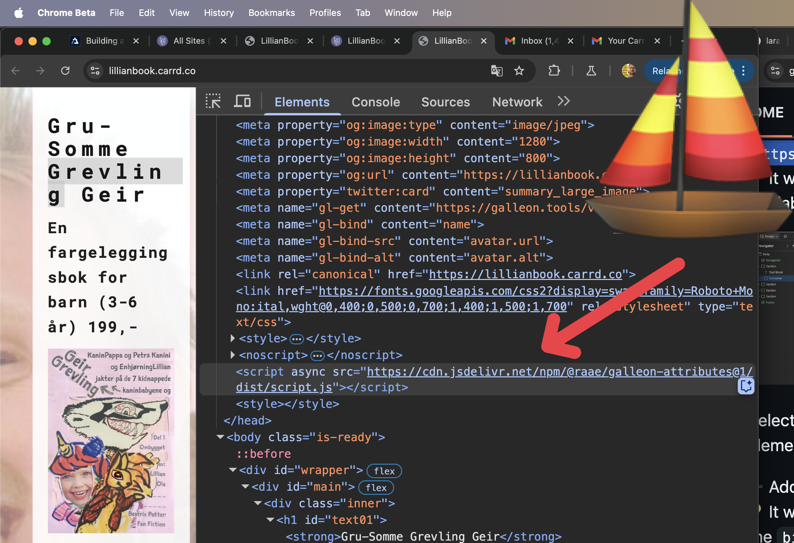
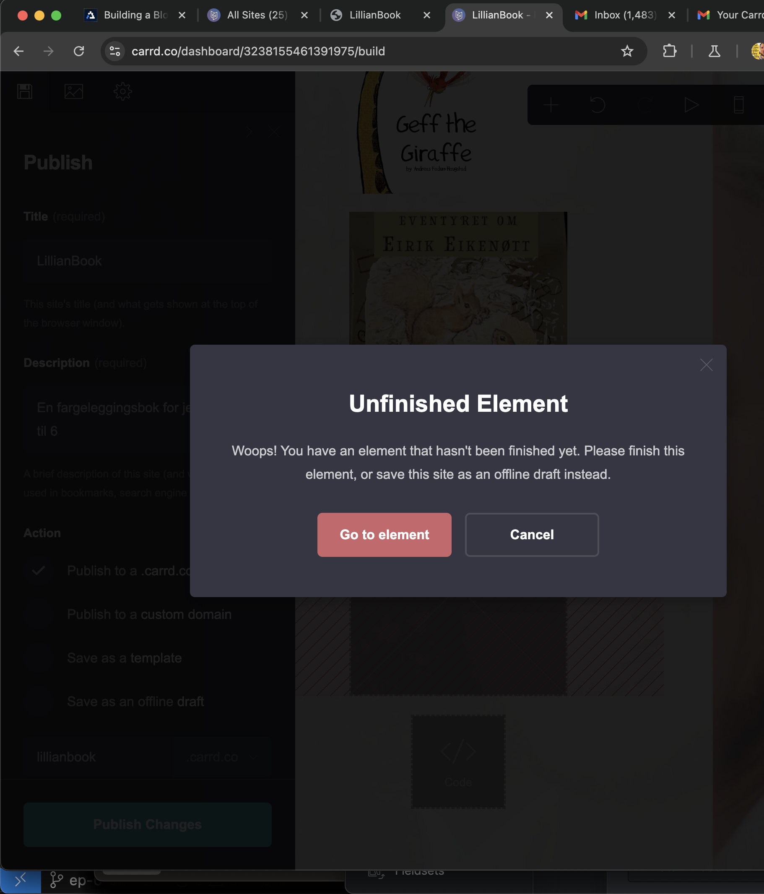
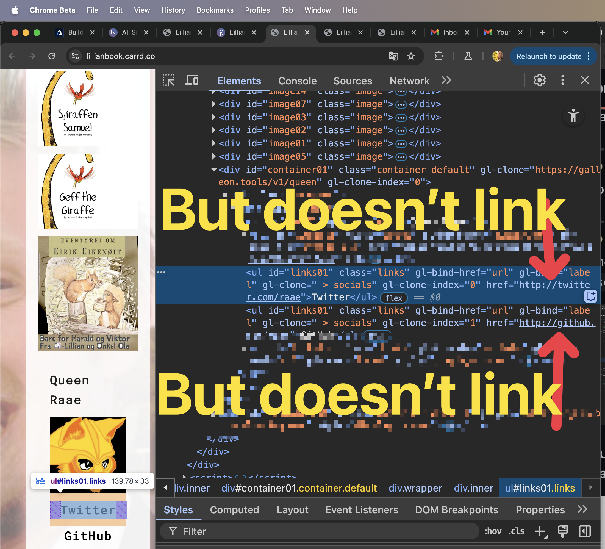

I tested our own docs for Galleon attributes on our [Queen Raae's github](https://github.com/queen-raae/galleon-attributes)

## I Added the Script to the `<head>` in my Carrd website

1. I clicked "+ Add Element"
2. I clicked "</> Embed" to create a new Embed element
3. I Set Type to Code
4. I Copy / Pasted in `` 
5. I Set the Style to "Hidden" and then "Head" for my website's `<head>` element

I used these Excellent [Carrd docs](
https://carrd.co/docs/building/embedding-custom-code)

# [I Tested Galleon Attributes](https://github.com/queen-raae/galleon-attributes#test-galleon-attributes)

## Step 1. I added a container element to hold the data 

- I clicked "+ Add Element"
- I clicked "Container" to create a new Container element
- I Added the attribute `gl-get=https://galleon.tools/v1/queen`

## Step 2. I added a text element inside my container element

- I clicked "+ Add Element"
- I clicked "Text" to create a new Text element
- I Added the attribute `gl-bind=name`

## Step 3. I added an Image element inside my container element

- I clicked "+ Add Element"
- I clicked "Image" to create a new Image element
- I Added the attribute `gl-bind-src=avatar.url`
- I Added the attribute `gl-bind-alt=avatar.alt`

## Image with No Upload Blocks me from Publishing my Changes

This is where I hit my first rock right under the surface of the sea. I tried to publish my changes, but Carrd said no.

The error message looked like this:

I had to upload an image to make my element finished so I could publish the changes to my website.

## Image with placeholder shows the placeholder, not our test image

I looked at my site, an wouldn't you guess it, I'd hit another rock in the sea. I could see the image I had uploaded and NOT the image I was supposed to see, the image from our test api. Onward!

## Step 4. I added a Link element inside my container element

- I clicked "+ Add Element"
- I clicked "Link" to create a new Link element
- I Added the attribute `gl-iterate=socials`
- I Added the attribute `gl-bind-href=url`
- I Added the attribute `gl-bind=label`

## My Link doesn't work

Here I hit my third rock. I can see the link, but nothing happens when I try to cllick it. When I "Inspect" my website I see the href with the right link, see below:
 

Testing Galleon attributes with Carrd