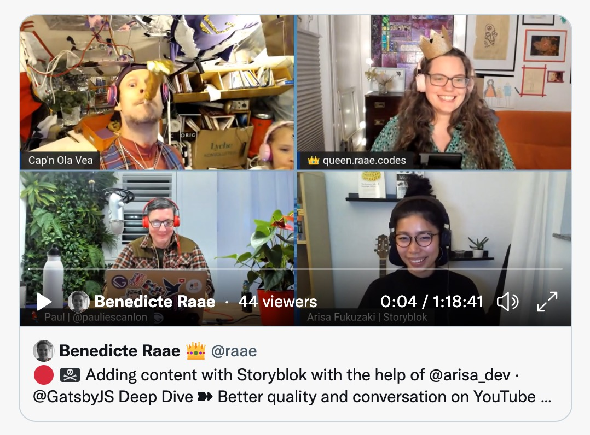

On [yesterday's unauthorized and rum-fueled treasure hunts](https://youtu.be/uOfTcQ6VMwQ) in the sharky waters around the Gatsby islands, Arisa Fukuzaki ([@arisa_dev](https://twitter.com/arisa_dev)) from Storyblok climbed onboard.

Our tiny task was to source an about page!

This time we did not source it ourselves. We used Storyblok's official source plugin. Most of the Content Management Systems have official plugins for sourcin`g. You should use these official plugins, if you are not exploring for skill-building purposes of course 🤪

Content in Storyblok can take any form you'd like. You create the schema yourself like you do most Headless CMS. Giving you the flexibility to make the content model you need for your project.

What is sourced and added to your Storyblok nodes is a JSON object you'll find on `storyblokEntry.content`.

<!--  -->

You'll grab that content on your page, parse it, loop over it, and render the bloks as you go along in a way that makes sense for each block. Or dump it out in a pre-tag to familiarize yourself like we did.

To connect a blok to a specific React component use its component field.

Dumping all the content as JSON on the node does not take advantage of Gatsby's Data Layer properly. For instance, your images will not be adequately sourced into Gatsby... Hopefully, they'll figure out a way to improve on this for future versions.

However, a fascinating thing happens when you take the time to connect Gatsby and Storyblok properly. You get a **live preview **of how the content will look on your Gatsby page inside the Storyblok editor.

To do so, follow the [Gatsby + Storyblok tutorial](https://www.storyblok.com/tp/add-a-headless-cms-to-gatsby-5-minutes), or take a peek at the [Storybok + Gatsby Boilerplate](https://github.com/storyblok/gatsby-storyblok-boilerplate) (with a slightly updated approach).

All the best,  
Queen Raae

**PS:** The code [can be found on Github](https://github.com/queen-raae/nattermob.dev) and if you wanna hang out with other Gatsby/Nattermob Pirates, check out the [discussions in the same repo](https://github.com/raae/nattermob.dev/discussions).

**PPS:** Next week is the last show of the season. Let us know what you would like us to explore in season 3: payment, more data layer, gated content, merch shop?
