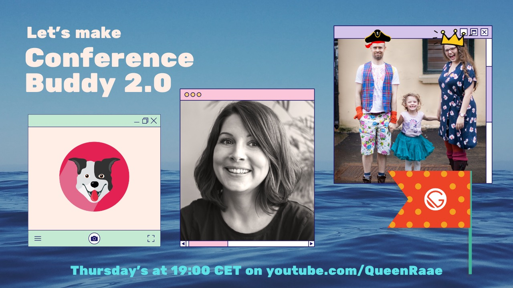

_In a dramatic movie trailer voice..._
Today at 19:00 CET the journey towards Conference Buddy 2.0 [begins on YouTube](https://youtu.be/ZTIoA298mX4).

## What is Conference Buddy?

Conference Buddy is an initiative started by [Mirjam](https://twitter.com/mirjam_diala). Its purpose is to help lessen the anxiety for first-time conference-goers by giving them a chance to get to know other attendees ahead of time.

## What is the plan?

Ola, guests, and I will advise Mirjam while she tackles creating a new [conferencebuddy.io](https://www.conferencebuddy.io/) with Gatsby +++.

Tonight we'll have a look at Mirjam's initial Gatsby setup, talk about her plans for Conference Buddy 2.0 and decide on a next step (aka. homework for Mirjam 🤪).

Be a fly on the wall, or an active participant, in the development of Conference Buddy 2.0 by tuning in Thursdays at 19.00 CET.

&nbsp;  
All the best,  
Queen Raae

**PS:** If you would like to be notified 30 minutes beforehand, sign up for [stream reminders](/emails/reminders/).
