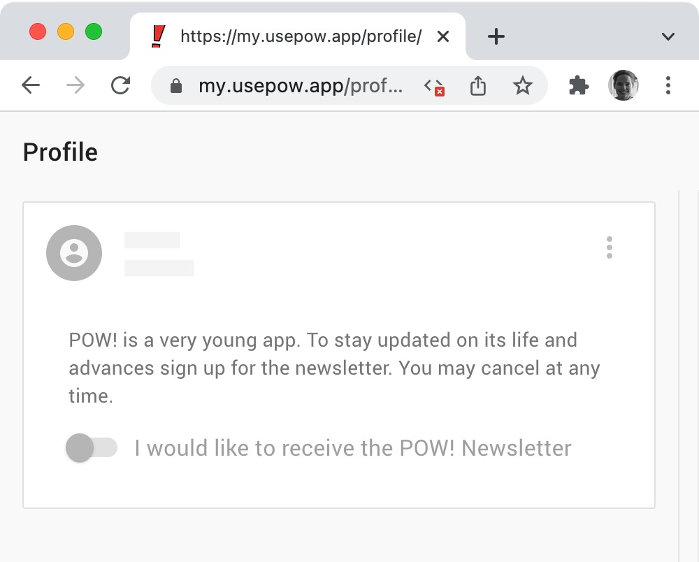
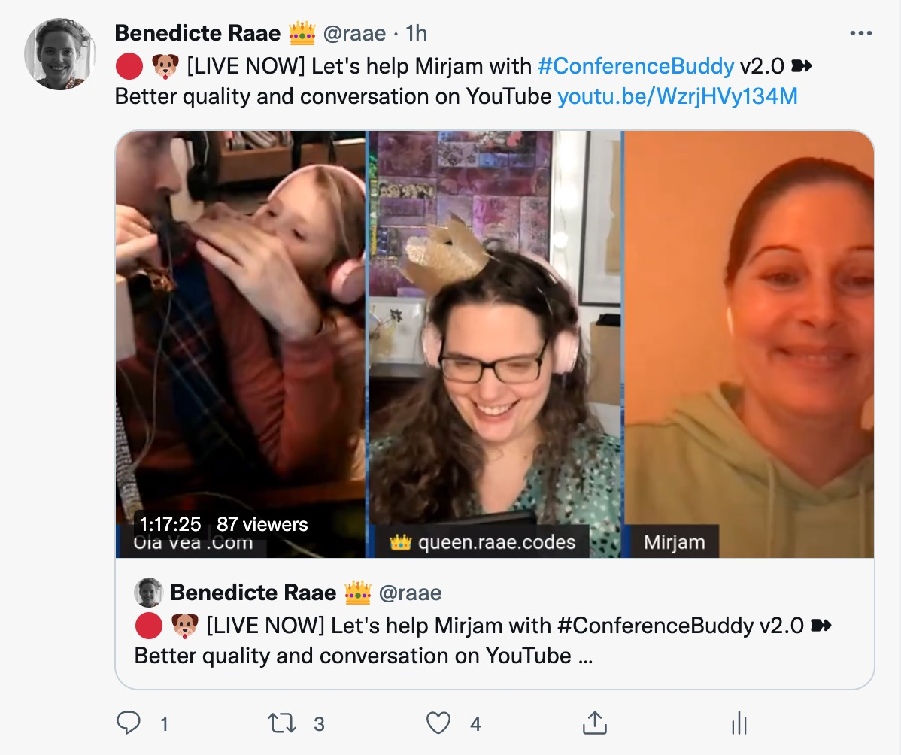

In [yesterday's email](/posts/2022-01-06-client-only-routes/), I alluded to a different approach for authenticated routes.

Instead of reaching for [client-side only routes](https://www.gatsbyjs.com/docs/how-to/routing/client-only-routes-and-user-authentication/#adjusting-routes-to-account-for-authenticated-users) I more often utilize statically generated pages even for the authenticated routes these days.

You can protect these routes the same way Gatsby documents for client-side only routes. However, this does not consider a visitor refreshing a page while on an authenticated route. The code will kick the visitor off the page before the authentication status is determined.

Instead, I recommend assuming the visitor is supposed to be there if they hit an authenticated route. While waiting for the data to load, I will show a skeleton version of the page. If it turns out the visitor is not supposed to be there, I kick them off.

A skeleton version of a page is as much of the user interface as is possible without the data only available client-side. There is often a lot to show, menus, headers, icons, etc.

You can see the skeleton version of a profile page in action for [POW!](https://my.usepow.app/profile/). If you get kicked off too soon, disable javascript to see it.

This approach gives a better experience for visitors using your app correctly; they will get a smooth transition from skeleton to the page filled with data. Visitors testing out routes they should not be on will get a flash of skeleton page before being kicked off, a slightly subpar experience.

Incidentally, the same topic of discussion, and pair programming, as on yesterday's [unauthorized and rum-fueled treasure hunt](https://youtu.be/WzrjHVy134M) in the sharky waters around the Gatsby islands, helping Mirjam with Conference Buddy v2.

&nbsp;  
Did any of this make sense?
Reply to let me know either way...

&nbsp;  
All the best,  
Queen Raae
