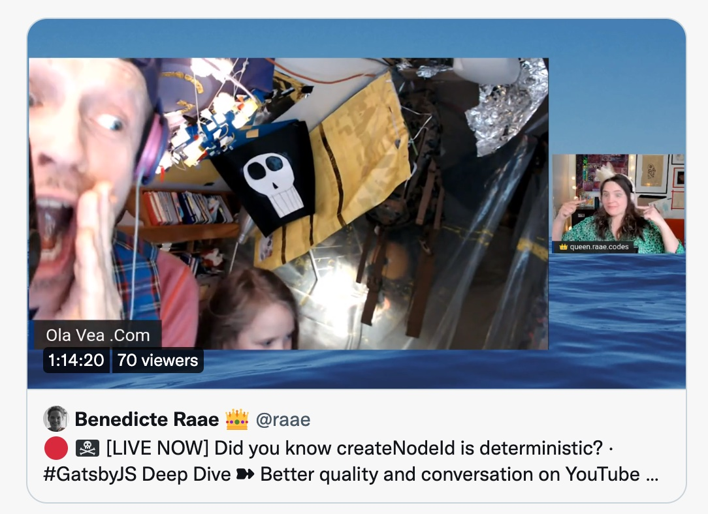

**TLDR:** When using the action `createNode` inside `onCreateNode` it is super duper important to give the node a parent!

On yesterday's unauthorized and rum-fueled [treasure hunt](https://youtu.be/SWumzHLEpYA) in the sharky waters around the Gatsby islands, we worked through the code from the last two emails:

- [Gatsby's createNodeId is deterministic 📥 💡](/posts/2022-03-30-deterministic/)
- [Should we skip the Gatsby Cache altogether? 🛑 🔄](/posts/2022-03-31-skip-cache/)

[](https://youtu.be/SWumzHLEpYA)

But we also briefly touched on a bug I had to fix from last week's ImageCDN stream. The YouTubeThumbnail nodes were "lost" between builds... 😱

Gatsby caches nodes between builds. If you call `createNode` with the same nodeId and content digest as a cached node, Gatsby will not go through the node creation process again. It will use the cached node, skipping `onCreateNode` for that node.

Since caches can get out of hand, Gatsby throws out all nodes that are not "touched" during the node sourcing phase. And this is where our problem arises.

A node is considered touched either by the use of `createNode` or `touchNode`. However, the code "touching" our YouTubeThumbnail nodes is skipped when its YouTube node is cached.

Luckily a node is also considered "touched" if its parent is "touched": problem solved 👩‍👧

```js
createNode({
  id: youTubeThumbnailNodeId,
  parent: node.id, // 👈 👈 👈
  youTubeId: node.youTubeId,
  url: node.oEmbed.thumbnail_url,
  mimeType: "image/jpeg",
  filename: node.youTubeId + ".jpg",
  height: node.oEmbed.thumbnail_height,
  width: node.oEmbed.thumbnail_width,
  internal: {
    type: YOUTUBE_THUMBNAIL_TYPE,
    contentDigest: node.internal.contentDigest,
  },
});
```

&nbsp;  
All the best,  
Queen Raae
