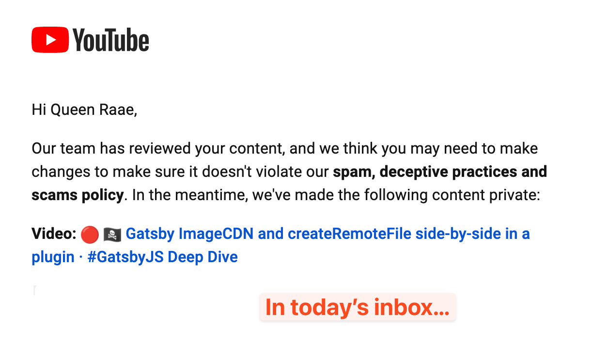

We added back support for downloading the YouTube thumbnails as local file nodes on yesterday's apparently [deceiful and spam-packed treasure hunt](https://youtu.be/MjcYzjYIFuI) in the sharky waters around the Gatsby islands

[](https://twitter.com/raae/status/1527593806513709057?s=20&t=8HbGrJ66ytV2IfM0qvwhDw)

We removed it in exchanging for ImageCDN on a [treasure hunt with Ward of Gatsby](/2022-03-25-image-cdn-plugin/), but as we are working on a plugin, I later realized it should support both 🤦‍♀️

[](https://youtu.be/IDW2IfaHGIs)

## The What?

Let the user of our plugin (gatsby-source-youtube-oembed) decide if they want to utilize Gatsby ImageCDN or download remote images as local file nodes.

## The Why?

We don't know where our users are deploying their sites as plugin authors. As far as I know, only Netlify and Gatsby Cloud support Gatsby ImageCDN at the moment, and it's pretty clear they'll charge extra for it in the future. Also, some Gatsby users deploy to their own servers or other static hosts.

## The How

We added a plugin option letting the user configure their choice:

```js
// gatsby-node.js
exports.pluginOptionsSchema = ({ Joi }) => {
  return Joi.object({
    thumbnailMode: Joi.string().valid("none", "cdn", "download").default("cdn"),
  });
};
```

Then we made sure to check the plugin option in onCreateNode to decide what type of thumbnail node to make:

```js
// gatsby-node.js
const { createRemoteFileNode } = require("gatsby-source-filesystem");

exports.onCreateNode = async (gatsbyUtils, pluginOptions) => {
  const { node, actions, createNodeId, getCache } = gatsbyUtils;
  const { createNode, createNodeField } = gatsbyUtils.actions;

  if (node.internal.type === YOUTUBE_TYPE) {
    if (pluginOptions.thumbnailMode === "cdn") {
      createNode({
        id: createNodeId(`Thumbnail >>> ${node.youTubeId}`),
        parent: node.id,
        youTubeId: node.youTubeId,
        url: node.oEmbed.thumbnail_url,
        mimeType: "image/jpeg",
        filename: node.youTubeId + ".jpg",
        height: node.oEmbed.thumbnail_height,
        width: node.oEmbed.thumbnail_width,
        internal: {
          type: "YouTubeThumbnail",
          contentDigest: node.internal.contentDigest,
        },
      });
    } else if (pluginOptions.thumbnailMode === "download") {
      const imageFile = await createRemoteFileNode({
        url: node.oEmbed.thumbnail_url,
        parentNodeId: node.id,
        getCache,
        createNode,
        createNodeId,
      });

      createNodeField({
        node: node,
        name: "thumbnailFileId",
        value: imageFile.id,
      });
    }
  }
};
```

and we recheck it to customize the schema according to the chosen mode:

```js
// gatsby-node.js
const {
  addRemoteFilePolyfillInterface,
} = require("gatsby-plugin-utils/polyfill-remote-file");

exports.createSchemaCustomization = (gatsbyUtils, pluginOptions) => {
  const { actions, schema } = gatsbyUtils;

  if (pluginOptions.thumbnailMode === "cdn") {
    const YouTubeType = `
      type YouTube implements Node {
        thumbnail: YouTubeThumbnail @link(from: "youTubeId" by: "youTubeId")
      }
    `;

    const YouTubeThumbnailType = addRemoteFilePolyfillInterface(
      schema.buildObjectType({
        name: `YouTubeThumbnail`,
        fields: {
          youTubeId: "String!",
        },
        interfaces: [`Node`, `RemoteFile`],
      }),
      {
        schema,
        actions,
      }
    );

    actions.createTypes([YouTubeType, YouTubeThumbnailType]);
  } else if (pluginOptions.thumbnailMode === "download") {
    const YouTubeType = `
      type YouTube implements Node {
        thumbnail: File @link(from: "fields.thumbnailFileId" by: "id")
      }
    `;
    actions.createTypes(YouTubeType);
  }
};
```

We should also update our docs, of course, with examples of how to get hold of the thumbnail image data in both modes, but that is for a later work session.

To see a full diff check out the [Pull Request on Github](https://github.com/queen-raae/gatsby-source-youtube-oembed/pull/11).

&nbsp;  
All the best,  
Queen Raae
