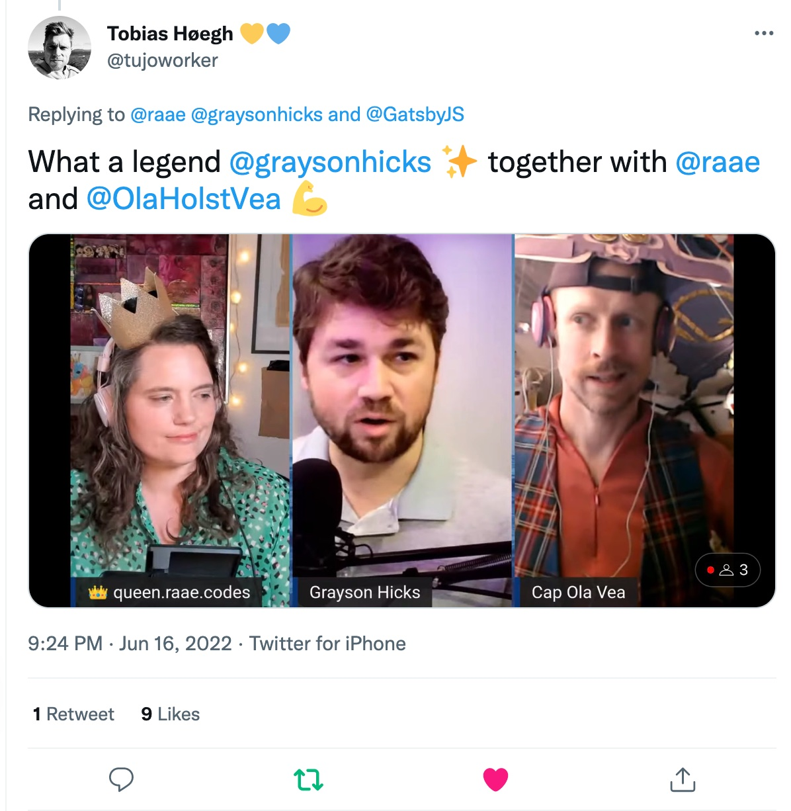

We had a blast yesterday coding and chatting with Grayson Hicks of Gatsby on our [unauthorized and rum-fueled treasure hunt](https://youtu.be/2moLttHSLWc) in the sharky waters around the Gatsby islands. And it seems we were not the only ones 👇

We worked on Gatsby ImageCDN support for Grayson's gatsby-plugin-remote-images.

- Read [Skip handling remote images yourself; there is a plugin for that!](/posts/2022-06-10-remote-image/) to learn more about why this plugin is da 💣
- Read [Your plugin should support both Gatsby Image CDN and downloading images as local file nodes](/posts/2022-05-20-image-modes/) for the why, what and how!
- Review the code in this [Draft PR](https://github.com/graysonhicks/gatsby-plugin-remote-images/pull/88)

&nbsp;  
All the best,  
Queen Raae
