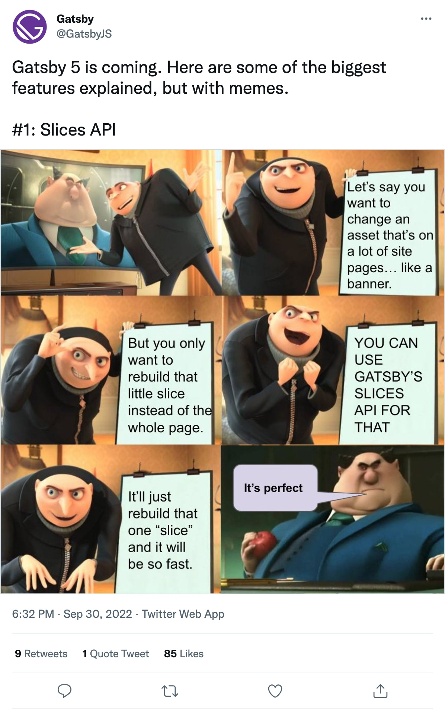

On Friday's [unauthorized and rum-fueled treasure hunt](https://youtu.be/F0Qs4NrSmBo), we got to play around with the still-not-public Slices alpha.

[](https://youtu.be/F0Qs4NrSmBo)

[Josh Johnson](https://twitter.com/0xJ05H) from Gatsby, who works on Slices, joined us to talk pizza, slices, photography, and more. We also got to meet his [dog Gilly](https://twitter.com/0xJ05H/status/1431021391617404934/photo/1).

## The What?

Refactor the site header of queen.raae.codes into a Slice.

## The Why?

Without Slices, every page rebuilds when the site header changes. With Slices, only the site header is rebuilt and stitched into place on every page, saving quite a lot of rebuilding time if you have complex pages.

[](https://twitter.com/OlaHolstVea/status/1576253338144079872)

## The How

For Slices to work, you register a component as a Slice using `createSlice` in a similar way as creating pages manually using `createPage`.

To use a slice, you reach for the custom Gatsby `Slice` component and pass it the name of your slice using the `alias` prop.

Rumer has is that down the line, you'll pop them in a slices folder, similarly to the pages folder 🤫

## The Code

```js
// File: gatsby-node.js

exports.createPages = async (gatsbyUtils) => {
  const { actions } = gatsbyUtils;

  actions.createSlice({
    id: `site-header`,
    component: require.resolve(`./src/components/site-header.js`),
  });
};
```

```js
// File: src/pages/index.js
import { Slice } from "gatsby";

export default function IndexPage() {
  return (
    <main>
      <Slice alias="site-header" />
      <!-- Rest of the page -->
    </main>
  );
}
```

&nbsp;

All the best,  
Queen Raae

&nbsp;

PS: As mentioned, next week is the fall holiday - so no treasure hunt or emails coming your way.
