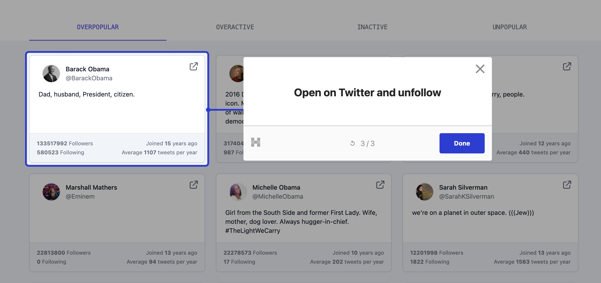

Yesterday, we added an onboarding tour to "Prune your follows" together with Cam Sloan of Hopscotch [unauthorized and rum-fueled treasure hunt](https://youtu.be/yDxF8FUNUbI) in the sharky waters around the Gatsby islands 🏴‍☠️

[](https://youtu.be/yDxF8FUNUbI)

To do so, we needed to add an external script. Since I wrote about [Third party scripts with Gatsby](/2022-01-05-external-scripts/) back in January, Gatsby has added a new way: the [`Script` component](https://www.gatsbyjs.com/docs/reference/built-in-components/gatsby-script/).

It can be used to add both inline scripts and external scripts.

Hopscotch provides us with an inline script:

```js
<script id="hopscotch-script" type="text/javascript">(function (w, d) {if (typeof w === "undefined") return;w.Hopscotch = w.Hopscotch || function () {(w.Hopscotch.q = w.Hopscotch.q || []).push(arguments);};var elm = d.createElement("div");elm.setAttribute("data-widget-host", "hopscotch");elm.setAttribute("data-props-api-key", "39311cf6-d7b7-5e00-b8e7");d.getElementsByTagName("body")[0].appendChild(elm);var s = d.createElement("script");s.src = "https://widgets.hopscotch.club/v1/widget.js?";s.async = 1;s.defer = 1;d.getElementsByTagName("body")[0].appendChild(s);  })(window, document);</script>
```

To make it work as a `Script` component, we had to:

- Exchange `script` for `Script`
- Make the inline code a "template literal"

```jsx
<Script
  id="hopscotch-script"
  type="text/javascript"
>{`(function (w, d) {if (typeof w === "undefined") return;w.Hopscotch = w.Hopscotch || function () {(w.Hopscotch.q = w.Hopscotch.q || []).push(arguments);};var elm = d.createElement("div");elm.setAttribute("data-widget-host", "hopscotch");elm.setAttribute("data-props-api-key", "39311cf6-d7b7-5e00-b8e7");d.getElementsByTagName("body")[0].appendChild(elm);var s = d.createElement("script");s.src = "https://widgets.hopscotch.club/v1/widget.js?";s.async = 1;s.defer = 1;d.getElementsByTagName("body")[0].appendChild(s);  })(window, document);`}</Script>
```

After that, we set up the tour in Hopscotch 🎉



I think the whole thing took us less than 15 minutes, but we managed to stream for a full hour anyhow: chatting, testing things out, and meeting Cam's dog 🤪

&nbsp;

All the best,  
Queen Raae
