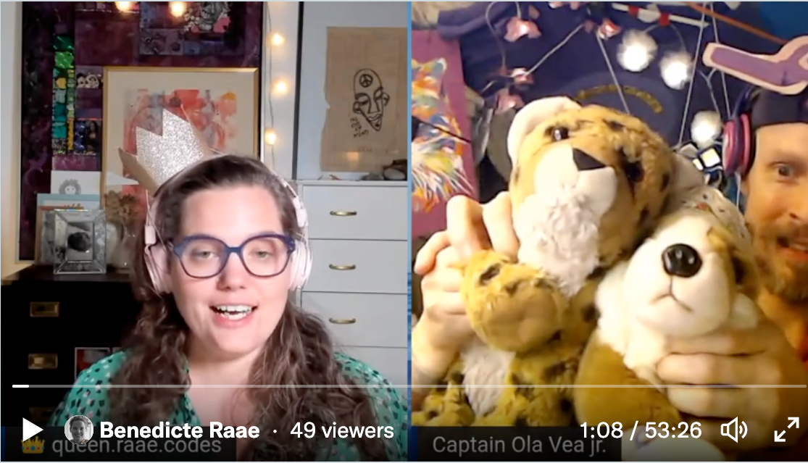
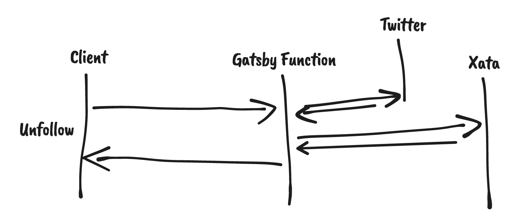
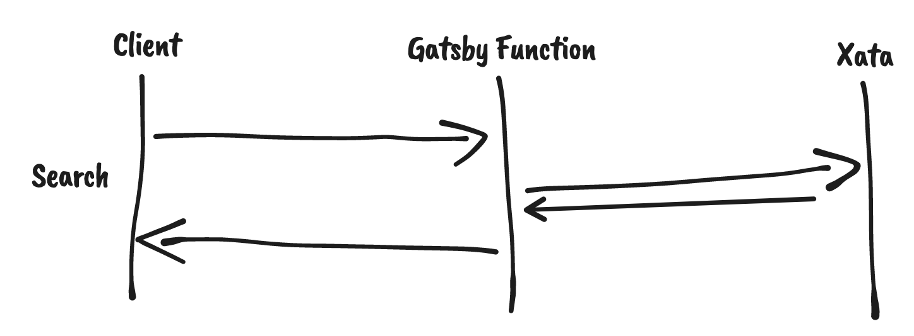

In this week's [unauthorized and rum-fueled treasure hunt](https://youtu.be/PCQrzSE33Y4) in the sharky waters around the Gatsby islands 🏴‍☠️], we added unfollow functionality from Prune your Follows.

When we create an interactive feature like that, we are squarely in the middle of Client Side Rendering (CSR) land. We don't want the page to reload when the user clicks or taps the unfollow button. We want to let the user keep going about their business while the server tries to fulfill the request.

So when someone clicks or taps the unfollow button in Prune your Follows:
Our client (a rehydrated Gatsby site) asks our server (a Gatsby Function) to unfollow the account.
Our Gatsby Function asks Twitter to unfollow the account in question.
Twitter responds.
Our Gatsby Function asks Xata to update the corresponding account record.
Xata responds.
Our Gatsby Function responds.

This "song and dance" is done again and again for all the different functionality.

For instance, the fuzzy search functionality we added last week. There is no need to talk Twitter, though, as all the accounts are periodically imported into the Xata database.

If we were relying on Server Side Rendering, the same song and dance would be happening. But the response from our server would be an entire web page, not just a little piece of data.

The same song and dance would also be happening with Server Side Components. But the response would be a component the framework knows how to stitch into the current web page.

&nbsp;

All the best,  
Queen Raae
