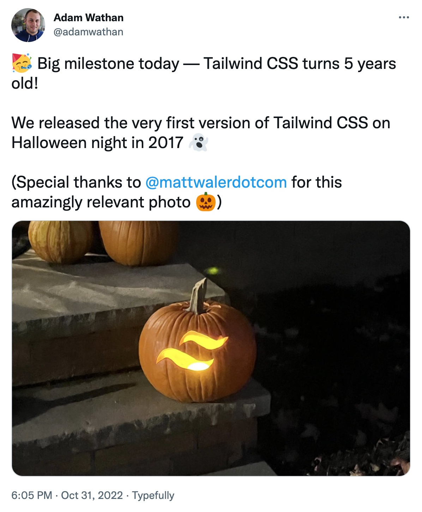

I held out for the longest time on two things: Halloween and Tailwind...

And little did I know these two things are, in fact, connected 🤯

Where are you with these two?

## Our streaming schedule this week

Notice the change of day!!!

🔴 🏴‍☠️ [Xata Launch Stream · #GatsbyJS Deep Dive](https://youtu.be/RFrQjA066sI)  
— Wednesday, November 2nd @ 19:00 CEST

## Other events

[The All New Gatsby 5 (Gatsby Webinar)](https://www.gatsbyjs.com/resources/webinars/gatsby-v5/)
— Tuesday, November 1st @ 17:00 CEST

&nbsp;

And, of course, next week is [Jamstack Conf](https://jamstack.org/conf/)!  
Reply if you'd like a 50% discount code.

&nbsp;

All the best,  
Queen Raae
