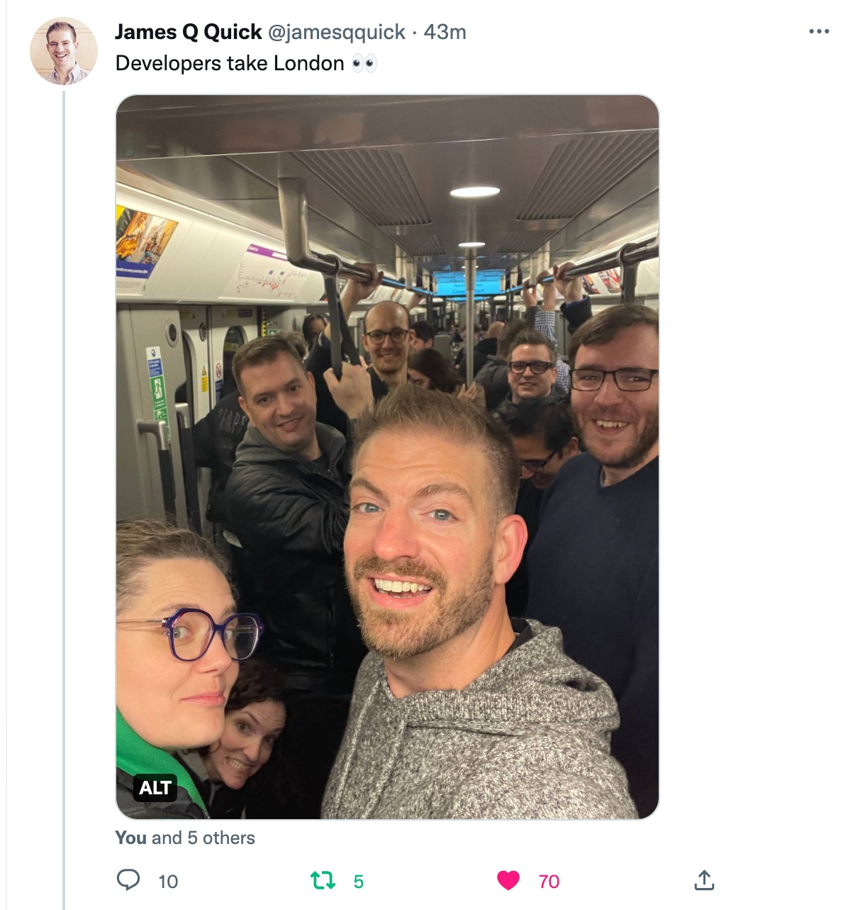

Conf season is a wrap for me!

Again, spot the pop of color 💚 🤣

Where should I apply to speak this spring?\
Do you have a favorite conference I should know about?

&nbsp;

## Our streaming schedule this week

🔴 🏴‍☠️ [TBD: Maybe Tailwind landing page design? · #GatsbyJS Deep&nbsp;Dive](https://youtu.be/7FiUfiyJXt8)\
— Thursday, November 24th @ 19:00 CET

It's the last stream of this season!\
We'll be back in the new year.

## Other events this week

[Webauthn (FIDO2) and Project Fugu (Learn with Jason)](https://www.learnwithjason.dev/webauthn-fido2-and-project-fugu)\
— Tuesday, November 22nd @ 19:30 CET

&nbsp;

All the best,  
Queen Raae
