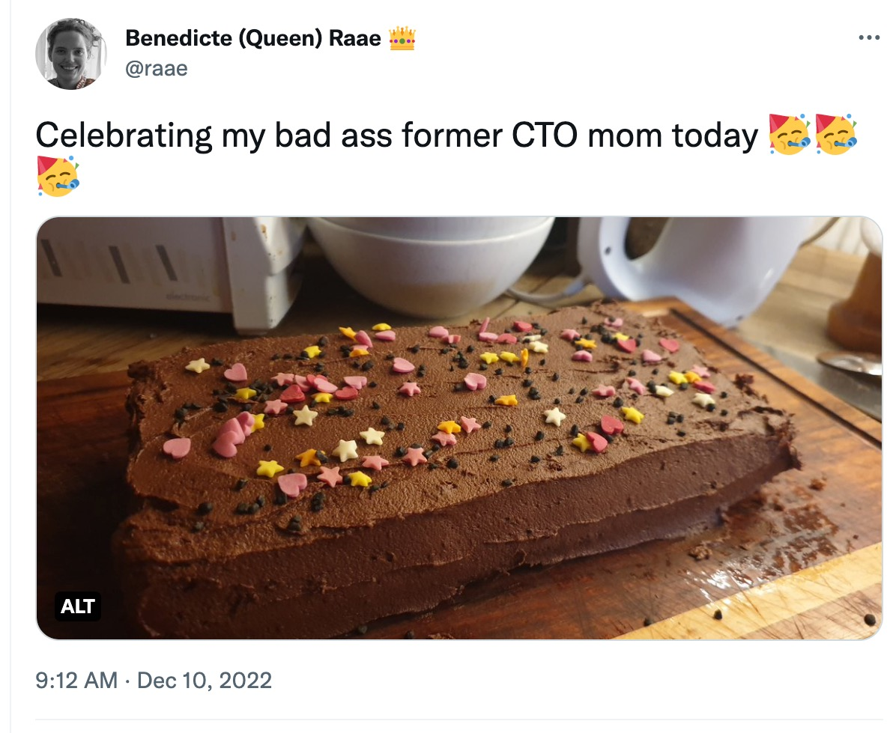

Happy third week of advent 🕯🕯🕯🕯

Last week was not the best. The whole family came down with something (🤧), giving you an unscheduled break from my emails and our streams.

Luckily we still managed to celebrate my badass mom, and former CTO, who turned 63 this weekend 🥳

And we are still planning on launching [Prune your Follows](https://pruneyourfollows.com/) this week. On Thursday, to be exact, it would be extra special if you managed to give us an upvote within the first hours. That would be 09:00-10:00 CET or 12:00-01:00 AM PST.

We are hitting some interesting Twitter limits, and we'll need to convey that in the UI before the launch so folks don't get unexplainable failures when unfollowing. I will make it happen in time 😬

Xata is running a [Christmas Hackathon](https://twitter.com/xata/status/1600186056942489600?s=20&t=HReA7KG8l53LPhrLOsqBZA). If you want to participate and need any help, let us know!

<aside class="notice">

Xata sponsors our work with Prune you Follows.

</aside>

## Our streaming schedule this week

🔴 🏴‍☠️ [Product Hunt Party · #PruneYourFollows Treasure&nbsp;Hunt](https://youtu.be/qAyaQaPIQCA)\
— Thursday, December 15th @ 19:00 CET

## Other events this week

[Let's Learn Auth0 Actions! with Will Johnson · Learn with Jason](https://www.learnwithjason.dev/let-s-learn-auth0-actions)\
— Tuesday, December 13th @ 19:30 CET

&nbsp;

All the best,  
Queen Raae
