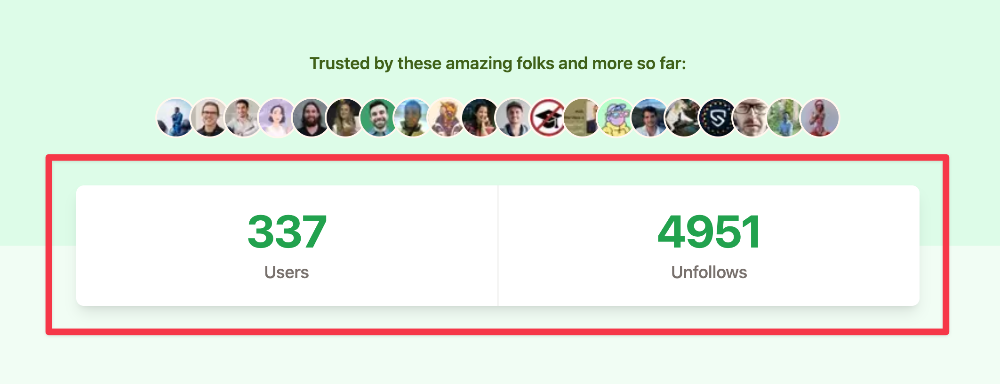

On this week's [unauthorized and rum-fueled treasure hunt](https://youtu.be/qAyaQaPIQCA) in the sharky waters around the Gatsby we added we added usage stats to [Prune your Follows](https://pruneyourfollows.com/).



## The Why

It's one way to show "social proof". Other ways are testimonials, reviews, the little avatars that are also present in the screenshot above, and more. Its purpose: Show potential users that it will be okay. Loads of people have already trusted us!

## The How

1️⃣ We queried Xata, our serverless database, for aggregated data,\
2️⃣ created a Gatsby data node to hold the information,\
3️⃣ and used a static Gatsby query to get hold of the information in our component.

```js
// File: /.gatsby-node.js

exports.sourceNodes = async (gatsbyUtils) => {
  const { reporter, actions, createNodeId, createContentDigest } = gatsbyUtils;
  const { createNode } = actions;

  // 1️⃣ Query Xata
  const result = await xata.db.accounts.aggregate({
    unfollowsTotal: {
      count: {
        filter: {
          //There is some older test data in there
          unfollowed: { $ge: new Date("2022-11-03") },
        },
      },
    },
    usersTotal: {
      uniqueCount: {
        column: "followed_by",
      },
    },
  });

  const statsData = {
    unfollowedCount: result.aggs.unfollowsTotal,
    userCount: result.aggs.usersTotal,
  };

  // 2️⃣ Create Node
  createNode({
    id: createNodeId("statistics"),
    ...statsData,
    internal: {
      type: "Statistics",
      contentDigest: createContentDigest(statsData),
    },
  });
};
```

```jsx
// File: ./src/domain/marketing/Stat.js

import React from "react";
import { useStaticQuery, graphql } from "gatsby";

export function Stats() {
  // 3️⃣ Use in component
  const data = useStaticQuery(graphql`
    query {
      statistics {
        unfollowedCount
        userCount
      }
    }
  `);

  return (
    <section>
      Users: {data.statistics.userCount}
      Unfollows: {data.statistics.unfollowedCount}
    </section>
  );
}
```

Check out the pull request for the complete example, including the tailwind design for the component.

All the best,\
Queen Raae
