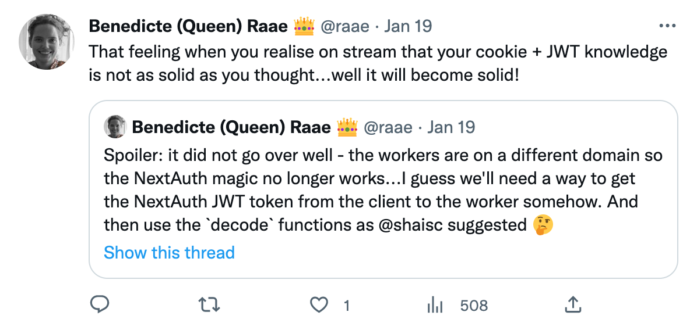

I naively thought all we needed for NextAuth to work with a Xata Worker was getting access to the `NEXTAUTH_SECRET` env variable.

But alas, when moving to a Xata Worker, the cookie set by NextAuth is unavailable as the Worker is served from another domain. However, the `getToken` function can also get the token from the `Authorization: 'Bearer token'. But how do we make that happen 🤷‍♀️

We'll figure it out over the next few weeks! I am sure 💪

If you have any experience with Cloudflare Workers (Xata Workers are an abstraction on top of Cloudflare Workers) and NextAuth, please reach out 🙏

&nbsp;

All the best,\
Queen Raae
