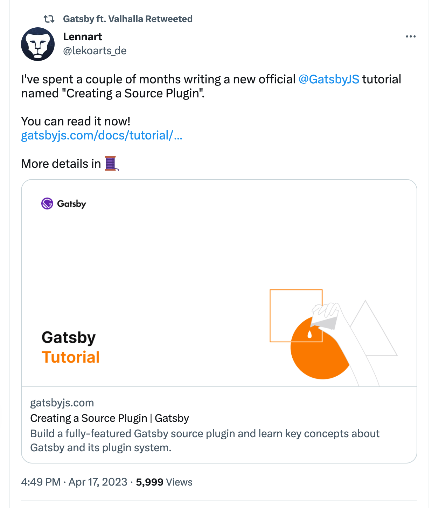

It seems the dust has settled on the Netlify acquisition of Gatsby. Last week Gatsby released the first version since February Gatsby v5.9, and [Lennart](https://twitter.com/lekoarts_de/status/1647975637427036160) published a new and comprehensive tutorial on [how to create a Source Plugin](https://www.gatsbyjs.com/docs/tutorial/creating-a-source-plugin/) 📝

&nbsp;

All the best,\
Queen Raae
