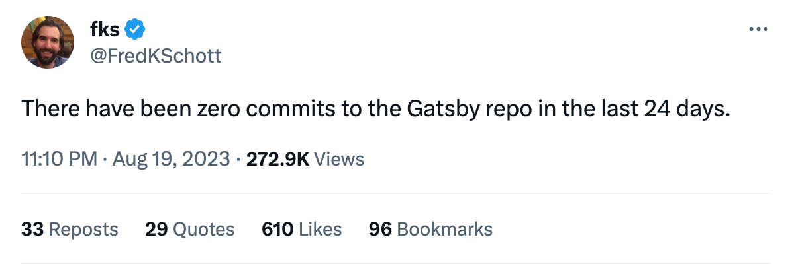
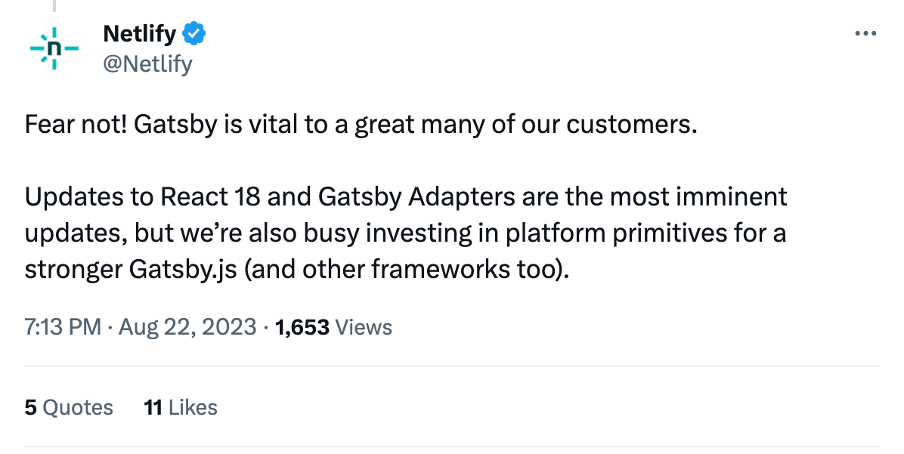

School has started here in Norway, the [#SummerOffice](<https://twitter.com/search?q=(from%3Aolaholstvea)%20until%3A2023-08-15%20since%3A2023-07-15&src=typed_query&f=top>) is closed until next year, and Labour Day Weekend is coming up in the US.

All pointing toward the end of summer in the northern hemisphere, and maybe even the end of Gatsby?

Last week [FredKSchott](https://twitter.com/FredKSchott/status/1693007599803752638?s=20) (co-creator of Astro - kinda biased fella come to think of it) stated:

And [wardpeet](https://twitter.com/wardpeet/status/1693014604694061194), former tech lead at Gatsby, answered:

The "Gatsby is dead" sentiment spread like wildflowers in the community.

However, Netlify followed up with:

What we do know is that Gatsby Cloud will be shutting down.

> For all Gatsby Cloud Free plan customers, your Gatsby Cloud instance will be discontinued on September 29, 2023.

We also know that Gatsby powers [19% of Netlify's enterprise customers](https://www.netlify.com/blog/framework-popularity-on-netlify/) - enterprise is where the money's at! Twitter-devs making blogs and portfolios, not so much.

This summer, Netlify [shipped adaptors](https://www.netlify.com/blog/gatsby-adapters-realize-the-full-potential-of-gatsby-on-your-platform/), making it possible for any hosting provider to run full-featured Gatsby sites. Before acquiring Gatsby, Netlify had to reverse engineer SSR, DSR, etc.

I am still hopeful that we'll see Gatsby evolve, but I'll be looking into Astro while also spending some more time tinkering with good old Node.

Totally feel the vibe of [this post doing its rounds on Twitter](https://twitter.com/flaviocopes/status/1695421873117438152).

**What are you up to this fall? Any projects got you extra excited? Let me know!**

All the best,\
Queen Raae
