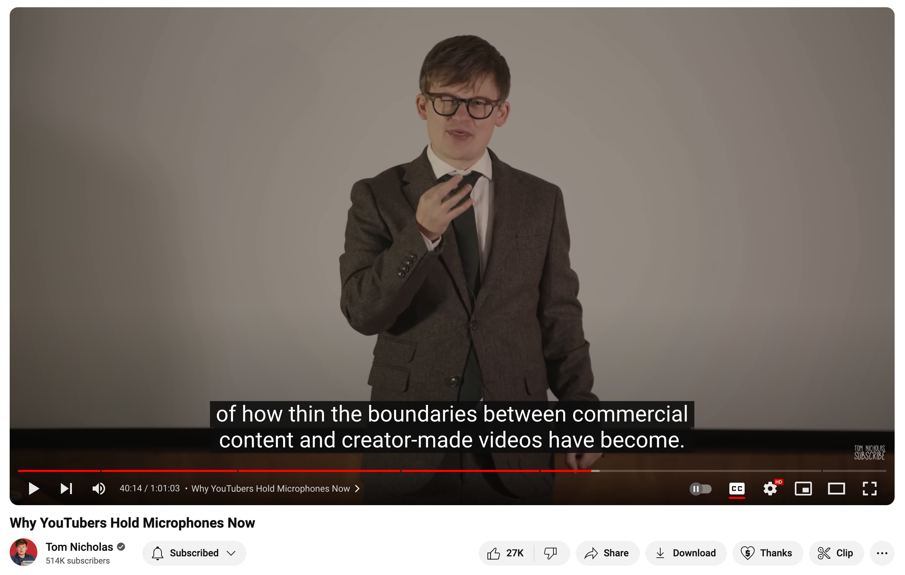
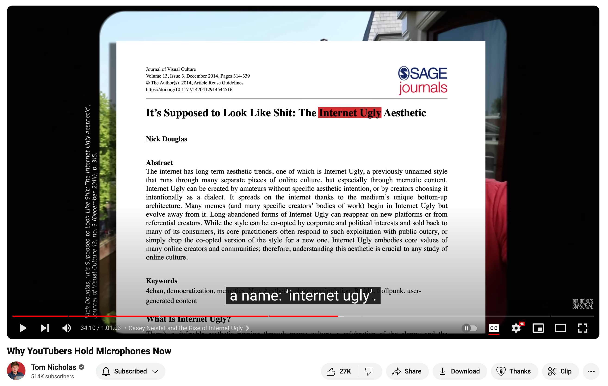
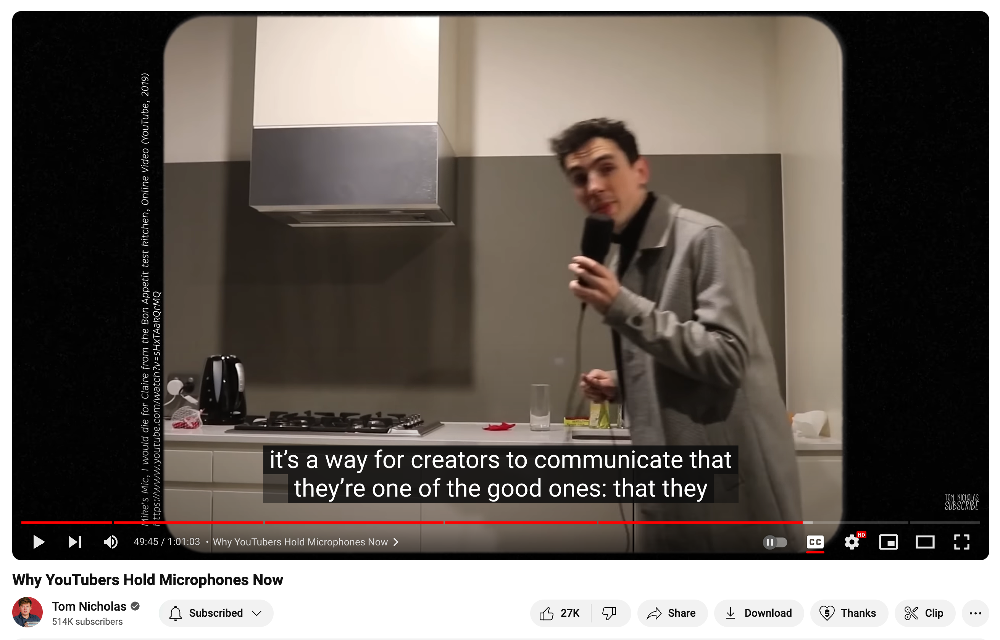

5 weeks ago a YouTube video by Tom Nicholas caught my eye: [Why YouTubers hold microphones now](https://youtu.be/0arvnAlV_C4) as I had seen this in typical lifestyle content. Little did I know that my Twitter feed would fill up with Tech-Dudes holding microphones so soon.

But here we are and if you are pondering _Why Tech-Dudes hold microphones now_ let's start by looking at what I believe to be the driving forces behind it.

But if you have no time for that, the **TLDR**: Authenticity.

## Overproduction of meh video content

There used to be obvious markers for what was better or worse quality. Graininess, pixelation, lack of structure, lack of music, rambling – any number of things could show us as viewers that the video creator was more amateur than auteur. And at the same time, we learned to love these artifacts of amateurish production. They were entertaining and human and genuine. 

When we wanted a quality video to watch, we knew what to look for. But the opposite of amateurishness is no longer a reliable signal for a quality video. 

As stated in [The Big Social Media Shift Nobody Notices](https://youtube.com/clip/UgkxbBt3hz7vvXv2umtOpR9TO_ChYgcl_RpT?si=Ru2Ocq3owztCoHRP) Dominik states unsurprisingly:

> Any fool can make a boring video look good now.

So much so that well-produced is no longer a marker the audience can rely on to signal good content. And the audience is getting tired of it. So we search for different signals that will lead us to content that is entertaining, but also leaves us feeling connected to the video creator.

What then, is a marker of great tech content?

## Overhyped professional techfluencers

Do you trust anything a professional techfluencer says? I don't, anymore.

It took me longer than I care to admit to understand that folks get paid to tweet. Paid to "organically" support a dev tool or product. The line between [commercial content and creator content](https://youtube.com/clip/UgkxDdXSKtLOviX3Ad5c7EcxSb9SDwstQGsy?si=sPOLGe1GLpgiuaMF) is thin as also mentioned by Tom:

And it makes me weary to venture into the field 😬

## Comeback of the Internet Ugly

This is true across the board, but maybe even more so in the tech sector. Nostalgia is running high for those of us who grew up on the World Wide Web. We, probably more than most, long for simpler times...the time coinciding with the era of [Internet Ugly](https://youtube.com/clip/UgkxbtYT7xp_v5WnPCAvSs32mvo6PGWQQL1k?si=-PR2wA2jZn06TK9t):

TODO: Add the definition of Internet Ugly

## Authenticity is the new black

All this to I say I believe we are seeing a collective longing for **authenticity**. Content that is real, that is human, that is trustworthy.

Holding a microphone then becomes a way to signal that you are in fact [one of the good ones](https://youtube.com/clip/UgkxtOwKa-OHJj1b046xisE6J0DldfB-AfQa?si=scGafbxYeXtu1ntK):

## What does this mean for you?

Maybe not grab a microphone just yet!

But maybe take the time to consider how you may have internalized certain markers that were not authentically you.

If the markers no longer serve as markers for others to navigate by, and they are not serving you? Why keep them around?

---

**Disclaimer**

I'm working on a service to help engineers, turned founders, **live stream** to generate real and human. And through consistently showing up live as the real humans they are, becoming someone you trust because you can only fake it live for so long.

And I'd love your input on [the sales page draft](https://deploy-preview-171--queen-raae-codes.netlify.app/go-live/)!

&nbsp;

&nbsp;

&nbsp;

&nbsp;

Clips for use in article, will be removed before publishing:

Personal attack: https://youtube.com/clip/UgkxnZ0J8vREOxEhvbDV3cXUs9tAh84e-BYU?si=yPeL_XeXVBxyuACd
Hard to make it look good: https://youtube.com/clip/UgkxCU6YhNIvbJ9FTWmXMD2CyenHNueo8WPi?si=xVM1B4BJ-bYII2U0
Imperfections: https://youtube.com/clip/UgkxMnouxUiRM1rzowRqfguFpAZ44vmEWz3M?si=zeItyFaQDn4a7Cci
Internet Ugly: https://youtube.com/clip/UgkxbtYT7xp_v5WnPCAvSs32mvo6PGWQQL1k?si=-PR2wA2jZn06TK9t
Thin boundery: https://youtube.com/clip/UgkxDdXSKtLOviX3Ad5c7EcxSb9SDwstQGsy?si=sPOLGe1GLpgiuaMF
Channeling internet ugly: https://youtube.com/clip/UgkxPV3Jf4uVF9Cpl0g1uIyXrJBRcBMDHGjY?si=WMuemVtvhx25GYaF
Response to coorporation: https://youtube.com/clip/UgkxrsqIZWDITWJJaFlqG_FJTFkEyuSzFc98?si=vOCXZBMdakEUJmYs
Best of both world: https://youtube.com/clip/UgkxY0Z_X9z5Fhb8wtTeRgaccHnjvOZHTnl3?si=GfiREVhW8AGaGLfp
They are one of the good ones: https://youtube.com/clip/UgkxtOwKa-OHJj1b046xisE6J0DldfB-AfQa?si=scGafbxYeXtu1ntK
