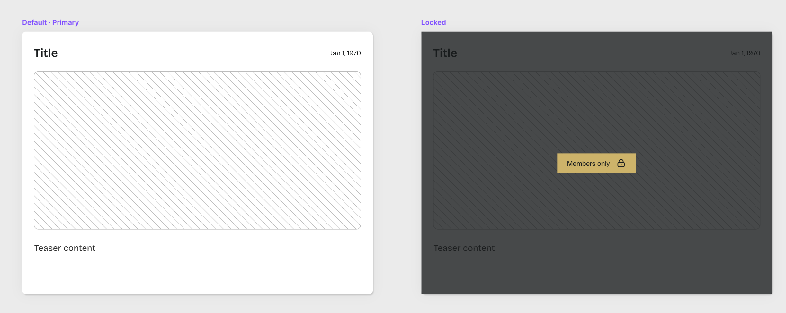
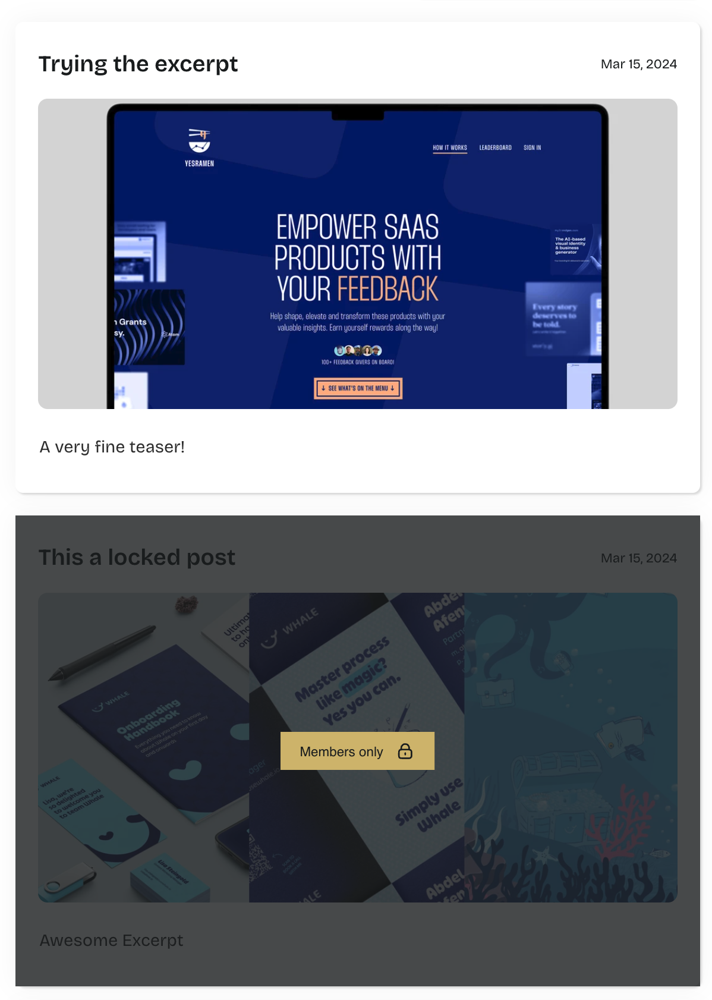

This week I'm building a [Framer x Outseta Patreon](https://www.youtube.com/@outseta/streams) clone live on stream together with Damien, a designer I know from the Interwebz.

We'll design the site in Framer, use Outseta for authentication and protection of members-only content, and stitch it all together with Framer's Code Overrides.

The feature we tackled today was to show a different post-item variant based on the link to the post. We'll configure [Outseta to protect](https://go.outseta.com/support/kb/categories/rQVZLeQ6/protected-content) all pages starting with "/posts/locked-" from unauthenticated visitors, so it makes sense to use the same mechanism for selecting the "locked" design of the post.



## The Code Override

The Code Override checks if the link of the post starts with "/posts/locked-". If the link does, it selects the "locked" variant, and if not it selects the "primary" variant:

```js
export function withCorrectVariant(Component): ComponentType {
  return (props) => {
    const { link } = props;
    const variant = link.startsWith("/posts/locked-") ? "Locked" : "Primary";
    return <Component {...props} variant={variant} />;
  };
}
```

That Code Override name is not my best work, please help me out by [suggesting a better name](https://twitter.com/intent/tweet?text=%40raae%20a%20better%20name%20would%20be)!

Gotcha: the `link` property is the pathname sans domain to the, and it starts with a "/".

## The Result

The items linking to pages starting with "/posts/locked-" now show the "locked" variant and the rest show the "primary" variant.



---

Extending Framer functionality with Code Overrides is such a superpower, especially if you are someone who can spell variant right on the first try...I cannot as becomes evident if you watch the full stream on [YouTube](https://www.youtube.com/live/s0eXaQr26Xs?si=_ToBcXuhKtfP72G2).
