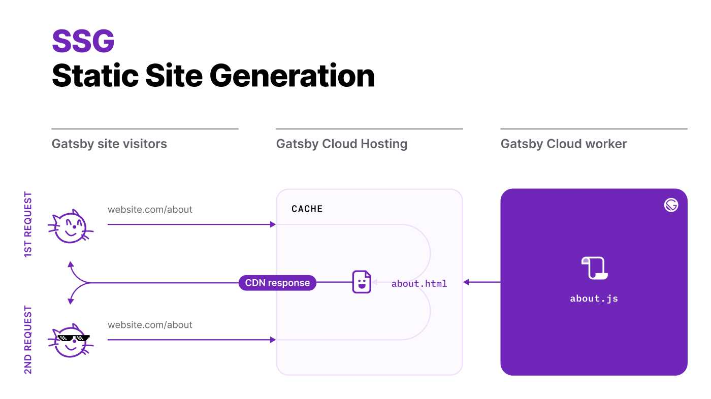

Static Site Generation (SSG) is Gatsby's default rendering mode.

_SSG is the default rendering mode in Gatsby. While the name has the word “static” in it, it doesn’t at all mean boring or lifeless. It simply means the entire site is pre-rendered into HTML, CSS, and JavaScript at build time, which then get served as static assets to the browser. Because all of that HTML, CSS, and JS is preprocessed and rendered at build time, Static Site Generation serves websites to users in the fastest possible way—your content is ready to go before the visitor even visits the site. ([Gatsby Docs about Rendering Options](https://www.gatsbyjs.com/docs/conceptual/rendering-options/#static-site-generation-ssg))._

**But how do we SSG?**

- [Watch the Live Screeencast](https://youtu.be/D_03KW4AkSk)

## SSG with Gatsby three ways

Read more in the [Gatsby Docs about Routing](https://www.gatsbyjs.com/docs/reference/routing/creating-routes/).

### 1. React components in `src/pages`

_TODO: Add code example_

### 2. File System Route API

_TODO: Add code example_

### 3. `createPages` in `gatsby-node.js`

_TODO: Add code example_

- https://www.gatsbyjs.com/docs/reference/config-files/gatsby-node/#createPages

## Content from the Gatsby Data Layer

For all three ways you can, and probabably want to, sprinkle in content from the Gatsby Data Layer. The Gatsby Data Layer holds all the data sourced at build time, and is therefore available when the site is statically generated.

_TODO: Add code example_

&nbsp;  
All the best,  
Queen Raae
