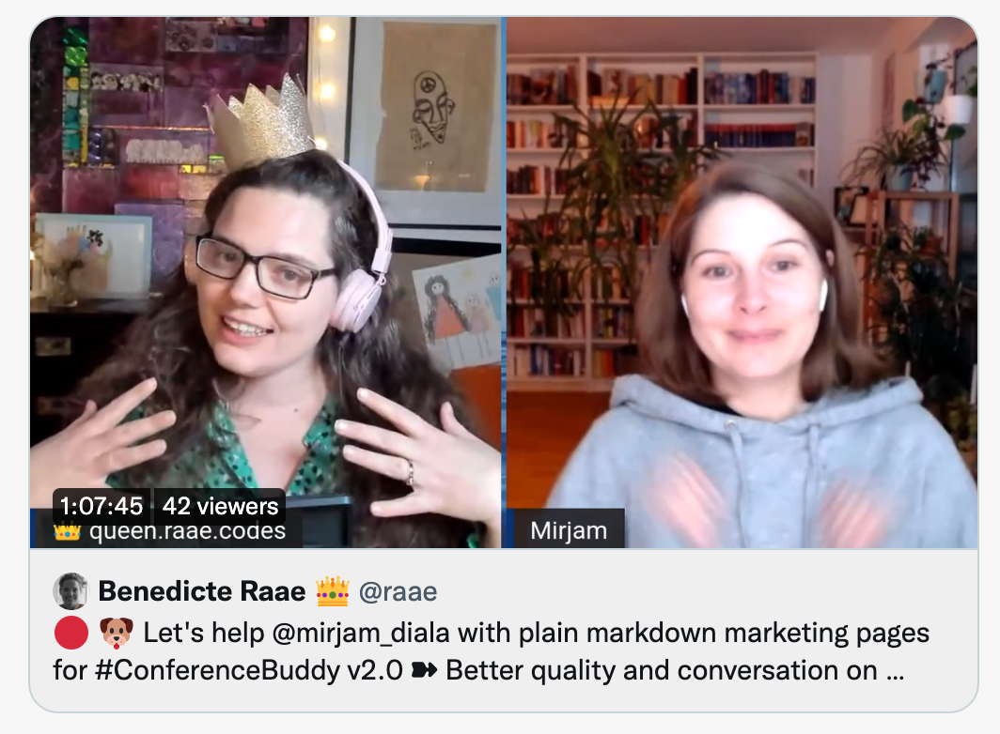

In yesterday's unauthorized and rum-fueled treasure hunts in the sharky waters around the Gatsby islands helping Mirjam we looked at how to use [markdown for marketing pages](https://youtu.be/Wipi2lw6Mvc?t=803).

[](https://youtu.be/Wipi2lw6Mvc?t=803)

One of the tricks we covered is to reference a markdown file from the front matter of another markdown file.

```md
---
sections:
  - title: About us
    md: ../about.md
---
```

It gives you access to the fully transformed markdown node through childMarkdownRemark.

```
query ExampleQuery {
  markdownRemark{
    frontmatter {
      sections {
        title
        md {
          childMarkdownRemark {
            html
          }
        }
      }
    }
  }
}
```

Kinda neat, right?

&nbsp;  
All the best,  
Queen Raae

&nbsp;  
**PS:** I am a markdown aficionado, how about you? Would you like more markdown tips and tricks?
