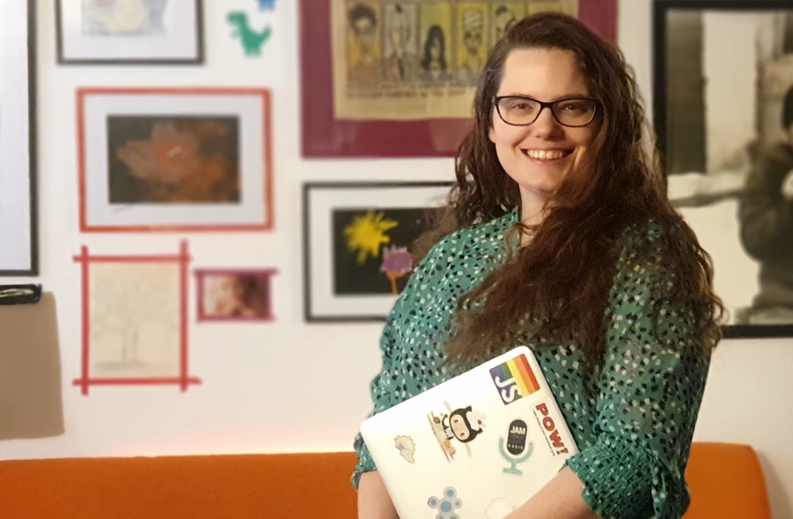

**🖐️ Hi, I'm Queen Raae.**

Currently living the fractional life: CTO at [Whee](https://whee.no) and Developer Avocado at [Outseta](https://outseta.com/?via=queen). I'm also dusting off the speaker badge. Open for internal talks on _joyful_ AI usage for both devs and the non-techie crowd → [Get in touch](/speaker/).

It all started roughly 30 years ago when my Norwegian teacher introduced a group of us girls to HTML + CSS in junior high. That spark led to a Master's in Computer Science, Gründerskolen, and a voyage that's included Remoteless, the first Varsom app, Lillygram, [POW!](https://pow.no), work for the Swedish Armed Forces, piraty [live streaming](https://www.youtube.com/QueenRaae/live), talks on [small and large stages](https://www.youtube.com/playlist?list=PL9W-8hhRoLoOPHYk1gtkvTSVNV1qleLWy), and plenty of galskap in between.

Holding it all together is Lilly Labs — the piratical family business I run with Cap'n Ola and our daughter the Pirate Princess Lillian.

Every other week I chat with [Benedikt Deicke](https://benediktdeicke.com/) on the [Slow & Steady podcast](https://slowandsteadypodcast.com/). My first name is Benedicte, so that's kinda funny: Benedikt and Benedicte (lol).

**🏴‍☠️ Welcome aboard 🏴‍☠️**

