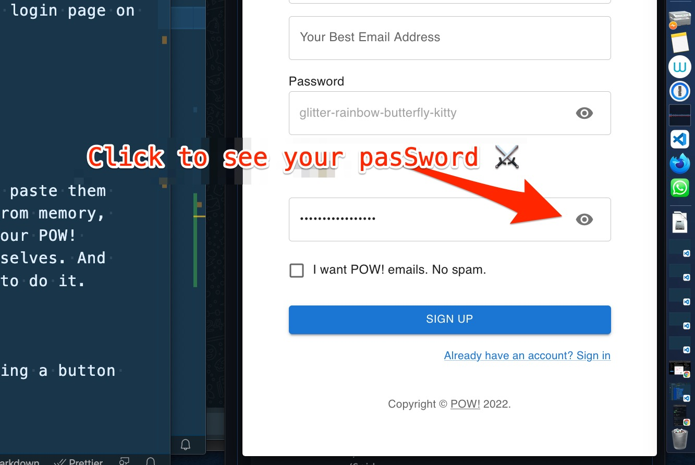

## My Sunday Skill Builder Session:

This Sunday, I made Password Peek-a-boo on the login page on our POW!-website. So now we're showing you your password if you poke the eye icon inside the password field. Later we will use that login page on the POW! app

## What did I do?

POW! Password Peek-a-boo


## Why did I do it?

I like to see my pasSwords when I copy-paste them from 1Password and write them from memory because I am a visual guy. So we want our POW! customers to be able to choose for themselves. And because Queen @raae told me to do it.

## How did I do it?

The short version:

- made a button with MUI

```js
<IconButton>👁️</IconButton>
```

- added an aria-label and an onClick handler

```js
<IconButton
  aria-label="toggle password visibility"
  onClick={handleClickShowPassword}
>
  👁️
</IconButton>
```

For the long version of My Sunday Skill Builder Session:, watch [Sunday's OlaCast on YouTube](https://youtu.be/v00Uro6UQvY)

&nbsp;  
💪😺👍  
Keep your skill-building-ship afloat this week!  
⛵🔧🏴‍☠️

&nbsp;  
Ola Vea  
Cap'n of his own skill-builder-ship
