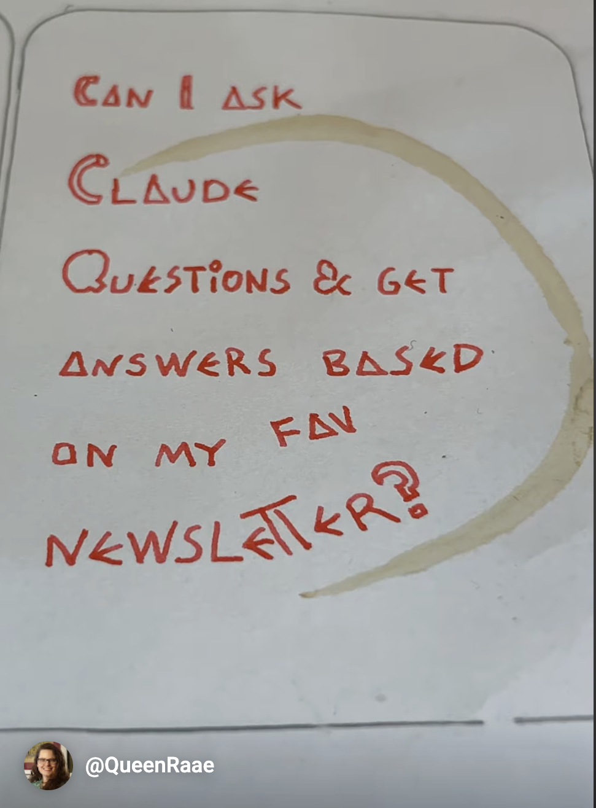

In short yes – if your favourite newsletter is using Ghost.org as backend and your favourite newsletter creator has set up an MCP server for you.

You can find a short youtube short about it here:
[a short youtube short](https://www.youtube.com/shorts/Uq4TMGCNBF4)

But I'm warning you it contains the same exact information. So ...... maybe don't go there.